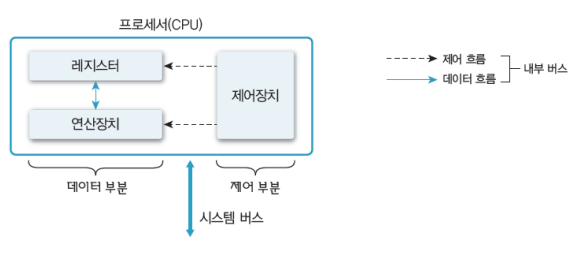
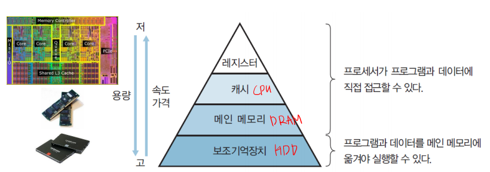
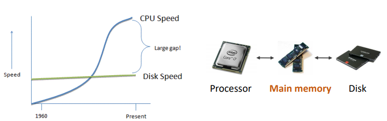

# chap1 컴퓨터 시스템 개요

[toc]

## 운영체제 

1. 프로세서 : **연산 수행**. 컴퓨터의 모든 장치 동작 제어 (CPU, 그래픽카드(GPU), 응용 전용 처리장치 등)

   - 프로세서에게 처리할 작업 할당 및 관리 (3장)

   - 프로그램의 프로세서 사용 제어 (4~5장)
     - 프로그램의 프로세서 사용 시간 관리
     - 복수 프로그램간 사용 시간 조율

     

2. 메모리 : 주 기억장치, 보조 기억장치 등

   - 메모리 할당 및 관리(7장)
     - 프로그램의 요청에 따른 메모리 할당 및 회수
     - 할당된 메모리 관리
   - 가상 메모리 관리(8장)
     - 가상메모리 생성 및 관리
     - 논리주소 → 물리주소 변환

3. 주변장치 : 프로세서와 메모리를 제외한 하드웨어들 : 입력장치, 출력장치, 저장장치 (키보드/마우스, 모니터, 네크워크 모뎀 등)

   - 장치 드라이버 관리
   - 인터럽트 처리 (3장)
     - 주변 장치의 요청 처리
   - 파일 및 디스크 관리 (9~10장)
     - 파일 생성 및 삭제
     - 디스크 공간 관리 등


## 레지스터 (Register)

1. 프로세서 **내부**에 있는 메모리
   - 프로세서가 사용할 데이터 저장
   - 컴퓨터에서 **가장 빠른** 메모리
2. 레지스터 종류
   - 용도에 따른 분류 : 전용/범용 레지스터
   - 사용자가 정보 변경 가능 여부에 따른 분류 : 사용자 가시/불가시 레지스터
     - 사용자 가시 레지스터
       - 데이터 레지스터 : 함수 연산에 필요한 데이터를 저장
       - 주소 레지스터 : 주소나 유효 주소를 계산하는 데 필요한 주소의 일부분을 저장한다. 
     - 사용자 불가시 레지스터
       - **프로그램 카운터** : 다음에 실행할 명령어의 주소를 보관하는 레지스터
       - **명령어 레지스터** : 현재 실행하는 명령어를 보관하는 레지스터
       - **누산기** : 데이터를 일시적으로 저장하는 레지스터
       - 메모리 버퍼(데이터) 레지스터 : 프로세서가 메모리에서 읽거나 메모리에 저장할 데이터 자체를 보관하는 버퍼 레지스터
       - 메모리 주소 레지스터 : 프로세서가 참조하려는 데이터의 주소를 명시하여 메모리에 접근하는 버퍼 레지스터
   - 저장하는 정보의 종류에 따른 분류 : 데이터/주소/상태 레지스터


## 메모리의 종류

1. 데이터를 저장하는 장치 (기억장치)

   

2. 주기억장치 (Main memory)

   - 프로세서가 수행할 프로그램과 데이터 저장
   - DRAM, DDR4을 주로 사용 (용량이 크고, 가격은 저렴)
   - **디스크 입출력 병목현상(I/O bottleneck) 해소**
     - 디스크까지 가는 것이 너무 느리니까, 성능을 빠르게 하는데 방해가 되니까(병목) 해소하기 위해서 존재
     - Disk와 Processor 사이에 왜 주기억장치가 들어가야하는가 ? **Disk, CPU 사이에 속도차가 존재**한다. 따라서 그 사이에 **Disk보다 크기는 작지만, 속도가 빠른 무언가를 놓고,** CPU가 일을 하는 동안 Disk에서 그 곳으로 데이터를 옮겨두자. 그리고 CPU가 필요로 하면 그 곳에서 빠르게 가져오자. 해서 나온 것이 주기억장치

   

3. 캐시 (Chach)

   - 프로세서 내부에 있는 메모리 (속도가 빠르고, 가격이 비쌈)
     - Core로부터, 레지스터는 더 가까이 위치하고 캐시가 더 멀리 위치한다.
     - 멀리 위치할수록 크기는 커지고 속도는 느려진다.  
   - **메인 메모리의 입출력 병목현상 해소**
     - 메인 메모리를 삽입했지만, 그래도 여전히 CPU와의 속도 차이가 너무 크다. 이를 해결하기 위해서 같은 방법으로 메인 메모리보다 작고 속도는 빠른 캐시 메모리를 삽입한 것이다.

   

   - 캐시의 동작

     

     - Cache hit(필요한 데이터 블록이 캐시에 존재), Cache miss(필요한 데이터 블록이 없음)

       - 캐시 블록? 메인 메모리에서 캐시를 가져올 때 정말 딱 필요한 만큼만 가져오는 것이 아니라 **그  주변 좌우(열)까지 포함한 블록** 단위로 가져온다(공간적 지역성)

       ```c
       // 2차원 배열의 모든 요소를 더할 때, A와 B 중 어느 것이 더 효율적인가 ?
       for (i = 0 ; i <= n ; i++) {
           for (j = 0 ; j < m ; j++) {
               x = x + (a[i][j]) ; // A
               or
               x = x + (a[j][i]) ; // B
       }
           
       // A가 더 효율적이다. 처음에 miss한 후에 캐시에 주변 데이터도 저장되어 계속 hit하기 때문.
       // B는 행이 바뀌기 때문에 계속 miss한다. 
       ```

     - 일반적으로 HW적으로 관리된다. 프로세서가 일을 하다가 데이터가 필요하면, 캐시에 있는지 확인한다. 그럼 캐시는 있는지 확인하고, 없으면(Cache miss) 메인 메모리로 가서 캐시로 가져온다. 그리고 그것을 프로세서로 옮긴다.

     - Cache miss가 일어나면 바로 메인 메모리에 가서 데이터를 가져오는 것보다 손해이다. 그럼, 캐시는 128kB 밖에 안 되는데 캐시를 쓰는 것이 과연 좋은걸까 ? → **캐시의 지역성** 

   - 캐시의 지역성

     - 공간적 지역성 (Spatial locality) : 참조한 주소와 인접한 주소를 참조하는 특성
       - 어떤 한 위치의 주소를 참조하면, 해당 **주소 근처를 다시 참조**할 가능성이 높다는 특징 
     - 시간적 지역성 (Temporal locality) : 한 번 참조한 주소를 곧 다시 참조하는 특성
     - 지역성은 캐시 적중률 (cache hit ratio)와 밀접한 관계

4. 보조기억장치

   - 프로그램과 데이터를 저장
   - 프로세서가 직접 접근할 수 없음(주변 장치)
     - 주 기억장치를 거쳐서 접근한다.
     - 용량이 크고 가격이 저렴
     - 프로그램/데이터 → 주기억장치 인 경우는 ? 가상 메모리. 하드디스크 일부를 메모리처럼 사용하는 것. 8GB의 메모리(주기억장치)밖에 없는데, 20GB의 프로그램(Disk)을 실행시키고 싶을 때. 


## 시스템 버스 (System Bus)

1. 하드웨어들이 데이터 및 신호를 주고 받는 물리적인 통로
2. 시스템 버스 종류
   - 데이터 버스 : 프로세서와 메인 메모리, 주변장치 사이에서 데이터를 전송
   - 주소 버스 : 프로세서가 시스템의 구성 요소를 식별하는 주소 정보를 전송
   - 제어 버스 : 프로세서가 시스템의 구성 요소를 제어하는 데 사용