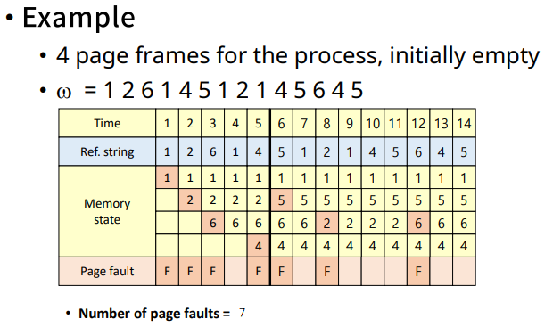
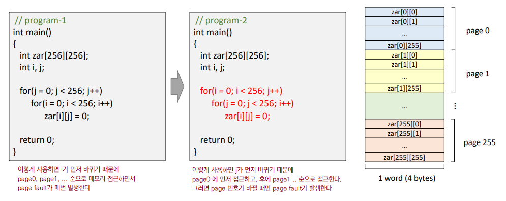

## chap10 가상 메모리 관리

[toc]

### 1. Virtual Memory Manangement

1. 가상 메모리 (기억 장치)
   - Non-continuous allocation : 사용자 프로그램을 block 단위로 분할하여 적재/실행
   - Paging/Segmentation system
   - 관리 목적 : 성능 최적화 (Cost model)
2. Cost model (Page sys)
   - Page fault frequency (발생 빈도) & Page fault rate (발생률) => 오버헤드에 비례
     - Page fault : swap device에서 해당 page를 메모리에 적재해두지 않은 경우
     - Page fault rate를 최소화 해야한다. 
   - Page reference string (d) : 프로세스의 수행 중 **참조한 페이지 번호 순서**
     - w = r1 · r2 · r3 ... rk (페이지 번호 1, 2, ... k)
   - Page fault rate F(w) : **전체 참조한 페이지 중에 몇 번 page fault가 발생**했는지
     - F(w) = Num of page faults during w / |w|
     - |w| : 프로세스가 실행하면서 참조한 페이지의 수 

 

 

### 2. Hardware components

1. Hardware Components

   - Address translation device (주소 사상 장치) : **주소 사상을 효율적**으로 수행하기 위해 (TLB 등)
   - Bit Vectors : **Page 사용 상황**에 대한 정보를 기록하는 비트들
     - 페이지 프레임의 페이지를 바꿔야할 때, 어떤 기준으로 바꿀지 정보를 제공
     - 페이지 프레임 (pf)마다 refenece/update bits가 하나씩 있다.

2. Bit Vectors

   - Refrenece bits (used bit) : 참조 비트 
     - 메모리에 적재된 각각의 page가 **최근에 참조**되었는지를 표시
     - 프로세스에 의해 참조되면 해당 page의 Ref.bit를 1로 설정 & 주기적으로 0으로 변경
   - Update bits (modified bits, write bits, **dirty bits**) : 갱신 비트
     - Page가 메모리에 적재된 후, 프로세스에 의해 **수정되었는지**를 표시
     - 프로세스에 의해 page가 수정되면, 해당 page의 (main memory 상 내용) != (Swap device의 내용)이 된다. 때문에 메모리에서 page가 나올 때 해당 page에 대한 **Write-back (to swap device)**이 필요하다. 이러한 이유로 Update bits가 필요하다.
     - 주기적 초기화 X => 메모리에서 나올 때 초기화

   

 

 

### 2. Software components

1. 가상 메모리 성능 향상을 위한 관리 기법들
2. Allocation strategies (할당 기법) : 각 프로세스에게 메모리를 **얼마만큼 줄 것**인가?
   - Fixed allocation (고정 할당) : 프로세스의 실행동안 **고정된 크기의 메모리 할당**
   - Variable allocation (가변 할당) : 프로세스의 실행동안 할당하는 메모리 크기가 **유동적**
   - 고려사항 : 프로세스 실행에 필요한 **메모리 양을 예측**해야 함
     - 너무 큰 메모리 할당 : 메모리 낭비
     - 너무 작은 메모리 할당 : Page fault rate 증가, 시스템 성능 저하
3. Fetch Strategies : 특정 page를 메모리에 **언제 적재**할 것인가?
   - Demand fetch (demand paging) : **필요할 때** 적재. 프로세스가 참조하는 페이지들만 적재
     - page fault overhead 존재
     - 실제 대부분의 시스템. 준수한 성능.
   - Anticipatory fetch (pre-paging) : 가까운 미래에 **참조될 가능성**이 높은 page 예측
     - 예측 성공시 page fault overhead 없음. 잘못된 예측 시 자원 낭비 큼
     - prediction overhead (예측해야하는 오버헤드, kernel의 개입), hit ratio에 민감
4. Placement Strategies : page/segment를 **어디에 적재**할 것인가?
   - Paging system에는 불필요 (공간의 크기가 일정해서)
   - Segmentation system에서의 배치 기법
     - First-fit / Best-fit / Worst-fit / Next-fit
5. **Replacement Strategies** : **새로운 page를 어떤 page와 교체**할 것인가? (빈 page frame이 없는 경우)
   - Fixed allocation을 위한 교체 기법
     - MIN(OPT, B0) algorithm
     - Random algorithm
     - FIFO(First In First Out) algorithm
     - LRU(Least Recently Used) algorithm
     - LFU(Least Frequently Used) algorithm
     - NUR(Not Used Recently) algorithm
     - Clock algorithm
     - Second chance algorithm
   - Variable allocation을 위한 교체 기법
     - VMIN(Variable MIN) algorithm
     - WS(Working Set) algorithm
     - PFF(Page Fault Frequency) algorithm
6. Cleaning Strategies : **변경된 page를 언제 write-back** 할 것인가?
   - Demand cleaning : 해당 page에 메모리에서 내려올 때 write-back . 대부분의 시스템
   - Anticipatory cleaning (pre-cleaning) : 더이상 변경될 가능성이 없다고 판단될 때 미리 write-back
     - 예측 성공시 page 교체시 발생하는 write-back 시간 절약
     - 예측 실패시 자원 낭비가 크다. + prediction overhead (예측하는데에 오버헤드)
7. Load Control Strategies : 시스템의 **multi-prograaming degree 조절** 
   - 적정 수준의 multi-programming degree를 유지 해야함
     - 저부하 상태 : 시스템 자원 낭비, 성능 저하
     - 고부하 상태 : 자원에 대한 경쟁 심화, 성능 저하, **Thrashing (과도한 page fault) 현상 발생**

 

 

### 3. Page replacement Strategies (Fixed allocation)

1. Locality : 프로세스가 프로그램/데이터의 특정 영역을 집중적으로 참조하는 현상

   - 공간적 지역성 : 참조한 영역과 **인적한 영역을 참조**하는 특성
   - 시간적 지역성 : 한 번 참조한 영역을 **곧 다시 참조**하는 특성

2. Replacement Strategies : **Fixed allocation** (pf의 수가 고정) vs Variable allocation

3. Min Algorithm 혹은 OPT(Optimal, 최적) algorithm

   - Minimize page fault frequency
   - 앞으로 **가장 오랫동안 참조되지 않을** page 교체 => 예측 불가, 실현 불가능
     - Tie-breaking rule : 앞으로 참조되지 않는 page가 여러개 일 때, 번호가 가장 큰/작은 페이지 교체
   - 교체 기법의 성능 평가 도구, 기준으로 사용

   

4. Random Algorithm

   - **무작위로 교체**할 page 선택. 낮은 오버헤드, 규칙X

5. FIFO Algorithm 

   - **가장 오래된** page를 교체 => page가 적재된 시간을 알고 있어야 함
   - 자주 사용되는 page가 교체될 가능성이 높음 (**Locality에 대한 고려 X**)
   - FIFO anomaly (Belady's anomaly) : FIFO 알고리즘의 경우 **더 많은 pf를 할당 받음에도 불구하고 page fault의 수가 증가**하는 경우가 있다. => 자원을 늘렸는데 성능은 더 낮아진다.

   

6. LRU (Least Recently Used) Algorithm

   - **가장 오랫동안 참조되지 않은** page를 교체 (Locality 활용) => page 참조 시마다 시간을 기록
   - Min Algorithm에 가장 근접하며 실제로 가장 많이 활용
   - 단점1) 참조시마다 시간을 기록 (overhead)
     - 해결) 정확한 시간 대신 **순서만 기록**하여 정보 수집을 간소화 함
   - 단점2) Loop 실행(1~4) 보다 작은 수의 pf (1~3) 이 할당된 경우, page fault 수가 매우 증가
     - 해결) **Allocation 기법**으로 사용=> pf의 수를 늘려줌

   

7. LFU (Least Frequently Used) Algorithm

   - **가장 참조 횟수가 적은** page를 교체 (Locality 활용) => page 참조 시마다 횟수를 누적
   - 단점1) 최근 적재된 참조될 가능성이 높은 page가 교체될 가능성이 있음
   - 단점2) 참조 횟수 누적 overhead. 단, LRU 대비 적은 overhead

   

8. NUR (Not Used Recently) Algorithm

   - **최근에 사용되지 않은** page를 교체, LRU 보다 적은 overhead로 비슷한 성능 달성 목적
   - Bit vector 사용 : Reference bit vector (r) , Update bit vector (m)
     - 교체 순서 : (r, m) = (0, 0) → (0, 1) → (1, 0) → (1, 1)

9. Clock Algorithm

   - **pf들을 순차적으로 가리키는 pointer 를 사용**하여 교체될 page 결정
     - reference bit 사용 & 주기적 초기화 X
     - Pointer를 돌리면서 교체 page 결정 & 현재 가지고 있는 page의 refenece bit(r) 확인
       - r = 0인 경우, 교체 page로 결정
       - r = 1인 경우, reference bit 초기화 후 pointer 이동
   - 먼저 적재된 page가 교체될 가능성↑ (FIFO 유사) & Refenece bit를 사용하여 교체 (LRU or NUR 유사) 

   

10. Second Chance Algorithm

    - Clock Algorithm과 유사 & Update bit (m) 도 함께 고려
      - 현재 가리키고 있는 page의 (r, m) 확인
        - (0, 0) : 교체 page로 결정
        - (0, 1) : → (0, 0), write-back (cleaning) list에 추가 후 이동
        - (1, 0) : → (0, 0) 후 이동
        - (1, 1) : → (0, 1) 후 이동 

    

11. Other Algorithm

    - Additional-reference-bits algorithm
      - LRU approximation. 여러개의 reference bit를 가진다.
    - MRU (Most Recently Used) algorithm : LRU와 정반대. 가장 최근 페이지 변경
    - MFU (Most Frequently Used) algorithm : LFU와 정반대. 가장 참조 횟수가 많은 페이지 변경

 

 

### 4. Page replacement Strategies (Variable allocation)

1. Working Set (WS) Algorithm

   - Working set : process가 **특정 시점에 자주 참조하는 page들의 집합** (Locality)

     - 최근 **일정 시간(Δ, window size)동안** 참조된 page들의 집합. 시간에 따라 변함
     - W(t, Δ) : time interval [t-Δ, t] 동안 참조된 page들의 집합

   - Working set memory management

     - Working set을 메모리에 항상 유지 : page fault rate 감소, 시스템 성능 향상
     - Window size (Δ)는 고정 & memory allocation은 가변 : **Δ이 성능을 결정** 짓는다.
       - 참고) Window size (Δ)는 가변 & memory allocation은 고정 : LRU

   - Window size vs. WS size : locality 때문에 program size에 수렴

     

   - Working set transition

     

   - Mean number of frames allocated vs. page fault rate

     

   - Example

     

   - 기타 특징

     - 특성
       - 적재되는 page가 없더라고 메모리를 반납하는 page가 있을 수 있음
       - 새로 적재되는 page가 있더라도 교체되는 page가 없을 수 있음
     - 단점
       - WS management overhead 존재
       - Residence set (상주 집합)을 page fault가 없더라도 지속적으로 관리해야함
     - 성능 평가 : **Page fault 수 외 다른 지표**도 함께 봐야 함
       - example : time interval [1, 10] → page fault 수 = 5, 평균할당 pf 수 = 3.2
       - 평균 3.2개의 pf을 할당받은 상태에서 5번의 page fault 발생

2. Page Fault Frequency (PFF) Algorithm

   - **Residence set size를 page fault rate에 따라** 결정 (**page fault 가 발생했을 때** 관리)

     - Low page fault rate : 프로세스에게 할당된 pf 수를 감소 (long inter-fault time)
     - High page fault rate : 프로세스에게 할당된 pf 수를 증가 (short inter-fault time)

   - Criteria for page fault rate (IFT : Inter fault time & τ : threshold value)

     - IFT > τ : Low page fault rate. page fault가 잘 발생 X
     - IFT < τ : High page fault rate. page fault가 잘 발생

   - 알고리즘

     - 1) Page fault 발생시 IFT 계산 : IFT = 이전 page fault 시간 (tc) - 현재 page fault 시간(tc-1)
     - 2) IFT 판별 (page fault rate 판별) 후 Residence set 에 다음을 실행
       - 2-1) IFT > τ : (tc-1, tc] 동안 참조된 page 유지하고 나머지는 메모리에서 내림 => 메모리 할당 유지/감소
       - 2-2) IFT < τ : 기존 pages 유지하고 현재 참조된 page를 추가 적재 => 메모리 할당 증가

     

   - 기타 특징

     - 성능 평가 : page fault 수 외 다른 지표도 함께 봐야 함
       - example : time interval [1, 10] → page fault 수 = 5, 평균할당 pf 수 = 3.7
       - 평균 3.7개의 pf을 할당받은 상태에서 5번의 page fault 발생
     - 특징
       - 메모리 상태 변화가 page fault 발생 시에만 변해서 오버헤드는 적음

3. Variable MIN (VMIN) algorithm

   - **[t, t+Δ] 의 평균 메모리 할당량과 page fault 발생 횟수를 고려** => 예측 불가, 실현 불가능

   - 알고리즘

     - 1) page r이 t 시간에 참조되면, **(t, t+Δ] 사이에 다시 참조**되는지 확인
     - 2) 참조되면 r을 유지하고, 안되면 메모리에서 내린다.

     

   - 성능 평가 : **Page fault 수 외 다른 지표**도 함께 봐야 함

     - example : time interval [1, 10] → page fault 수 = 5, **평균할당 pf 수 = 1.6**
     - 평균 1.6개의 pf을 할당받은 상태에서 5번의 page fault 발생

   - 최적 성능을 위한 Δ값은 ? 

     - Δ = page fault 발생 시 처리비용 R / 한번 참조할 동안 page 메모리 유지 비용 U
     - R > Δ * U (Δ < R / U, Δ가 작음) : page fault 처리 비용 > page 유지 비용
     - R < Δ * U (Δ > R / U, Δ가 큼) : page fault 처리 비용 < page 유지 비용

 

 

### 5. Other considerations

1. Page size

   - 일반적인 page size : 2^7 (128) bytes ~ 2^22 (4M) bytes

   - page size는 적당한 게 좋지만 **점점 커지는 경향**이 있다 (HW 발전과 연관있음)

     - 1) CPU↑ : CPU의 발전 속도가 빨라서 CPU와 disk 사이의 속도차가 심해졌다. 그래서 I/O bottleneck이 될 가능성이 커졌고, 시스템 성능을 높이기 위해선 이를 피해야한다. 따라서 **I/O 시간을 감소시켜야** 하기 때문에 page size를 늘리고 있다.
     - 2) memory size ↑ : 메모리 사이즈는 커지는데 page size가 작으면 pf의 수가 증가하고, **커널의 오버헤드가 커지기 때문에** page size를 늘리고 있다.

     |                      |      small page size       |      large page size       |
     | :------------------: | :------------------------: | :------------------------: |
     | page table / pf의 수 | large (커널 오버헤드 크다) | small (커널 오버헤드 작음) |
     |     내부 단편화      |            감소            |            증가            |
     |       I/O 시간       |            증가            |            감소            |
     |       Locality       |            향상            |            저하            |
     |      Page fault      |            증가            |            감소            |

2. Program Restructuring

   - 가상 메모리 시스템의 특성에 맞도록 프로그램을 재구성

   

3. TLB Reach

   - TLB를 통해 접근할 수 있는 메모리의 양 = entry의 수 * page size
   - TLB의 hit ratio를 높이려면
     - TLB의 크기 증가 : 비싸다
     - Page 크기 증가 or 다양한 page size 사용(OS 지원)

