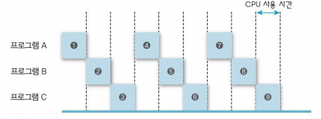
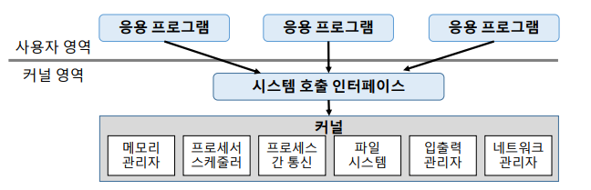
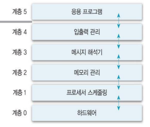
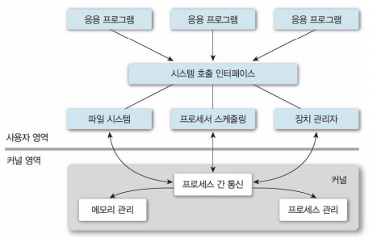
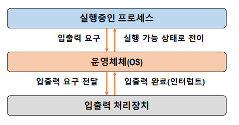

# chap 2 운영체제 개요

[toc]

### 1. 운영체제의 역할

1. User Interface (편리성) : CUI , GUI , EUCI
2. Resource management (효율성) : resource 관리
   - HW resource ( processor, memory, I/O devices, etc. )
   - SW resource ( file, application, message, signal, etc.)
3. Process and Thread management
4. System management (시스템 보호)

 

 

### 2. 운영체제의 구분

- System Call Interface : 사용자가 직접 Kernel에 접근해서 다루면 문제가 생길 수 있어서 그 통로 역할을 해주는 역할. 즉, 사용자가 사용할 수 있는 기능들을 모아둔 것 (시스템 라이브러리)

  

1. 동시 사용자 수

   - Single-user system : 한 명의 사용자만. 개인용(PC, mobile) 장비
     - 한 명의 사용자가 모든 시스템 자원 독점
     - 자원 관리 및 시스템 보호 방식 간단
   - Multi-user system : 동시에 여러 사용자. 서버, 클러스터 장비
     - 각종 시스템 파일에 대한 소유 권한 관리 필요
     - Multi-tasking 기능 필요. OS 기능 및 구조 복잡

2. 동시 실행 프로세스 수

   - Single-tasking system : 하나의 프로세스만. OS 구조 간단
   - Multi-tasking system : 동시에 여러 프로세스 수행 가능. OS 구조 복잡

3. 작업 수행 방식 (사용자가 느끼는 사용 환경)

   - Batch processing system : 일괄처리 시스템 (1950s ~ 1960s)

     - 사용자의 요청 작업(천공 카드 등) 을 일정시간 모아두었다가. 중앙에서 관리하여 한 번에 처리
     - 장) 많은 사용자가 시스템 자원 공유. 처리효율 향상
     - 단) 생산성 저하(같은 유형의 작업들이 모이기를 기다려야 함). 긴 응답시간

   - Time-sharing system : 시분할 시스템 (1960s ~ 1970s)

     

     - A, B, C 실행 시킬 때 일정시간 A 실행시키고, B 실행시키고 ... 를 반복. A 끝날 때까지 B가 안 기다려도 됨
     - 여러 사용자가 자원을 동시에 사용 (OS가 파일 시스템 및 가상 메모리 관리)
     - 사용자 지향적 : 대화형 시스템 / 단말기 사용
     - 장) 응답시간 단축, 생산성 향상(프로세서 유휴 시간 감소)
     - 단) 통신비용 증가(통신선, 보안 문제 등), 개인 사용자 체감 속도 저하

   - Personal Computing

     - 개인이 시스템 전체 독점. CPU 활용률 문제 X, 혼자쓰니 OS 단순
     - 장) 빠른 응답 시간
     - 단) 성능이 낮음

   - Parallel Processing System : 병렬처리 시스템

     - 성능 향상, 신뢰성 향상(CPU 하나 고장나도 OK)을 위해 단일 시스템 내에서 둘 이상의 프로세서 사용
     - CPU, 메모리 등의 자원 공유하므로 프로세서간 관계 및 역할 관리 필요

   - Distributed processing system : 분산처리 시스템

     - 네트워크를 기반으로 구축된 병렬처리 시스템
     - 물리적인 분산, 통신망 이용한 상호 연결. 각각 운영체제 탑재한 다수의 범용 시스템으로 구성.
     - 사용자는 분산운영체제를 통해 하나의 프로그램, 자원처럼 사용 가능 (은폐성)
     - 각 구성 요소들간의 독립성 유지, 공동 작업 가능
     - 장) 자원 공유를 통한 높은 성능. 고신뢰성, 높은 확정성
     - 단) 구축 및 관리가 어려움

   - Real-time system : 실시간 시스템

     - 작업 처리에 제한 시간(deadline)을 갖는 시스템
     - Hard real-time task : 시간 제약을 못 지키면 치명적 영향을 주는 작업. 발전소, 무기 제어 등
     - Soft real-time task : 동영상 재생 등

 

 

### 3. 운영체제의 구조

1. 운영 체제의 구조

   - 커널 : OS의 핵심으로, 메모리에 상주한다. 리소스 관리(프로세서, 메모리, 파일 등)
   - 유틸리티 : 비상주 프로그램, UI등 서비스 프로그램

2. 운영체제의 종류 

   - 단일 구조

     - 장) 커널 내 모듈간 직접 통신
     - 단) 커널의 거대화. 유지보수 어려움. 오류 및 버그, 악성코드로 한 모듈의 문제가 전체로

     

   - 계층 구조

     

     - 장) 모듈화. 설계 및 구현의 단순화
     - 단) 단일 구조 대비 성능 저하(원하는 기능 수행을 위해 여러 계층을 거쳐야 함)

   - 마이크로 커널 구조

     

     - 커널이 거대화되니, 필수 기능만 포함하여 크기를 최소화
     - 기타 기능은 사용자 영역에서 수행

 

 

### 4. 운영체제의 기능

1. 프로세스 관리

   - 프로세스 : 커널에 등록된 실행 단위 (실행 중인 프로그램)
   - OS의 프로세스 관리 기능
     - 생성/삭제, 상태 관리, 자원 할당
     - 프로세스 간 통신 및 동기화, 교착상태 해결
     - 정보 관리 : PCB (Process Control Bloc)

2. 프로세서(CPU라고 봐도 무방) 관리

   - 중앙 처리 장치(CPU) : 프로그램을 실행하는 핵심 자원
   - 프로세스 스케줄링 : 시스템 내의 프로세스 처리 순서 결정
   - 프로세서 할당 관리 : 프로세스들에 대한 프로세서 할당

3. 메모리 관리

   - 주기억장치 : 작업을 위한 프로그램 및 데이터를 올려 놓는 공간
   - Multi-user, Multi-tasking 시스템
     - 프로세스에 대한 메모리 할당 및 회수
     - 메모리 여유 공간 관리
     - 각 프로세스의 할당 메모리 영역 접근 보호
   - 메모리 할당 방법(scheme)
     - 전체 적재 : 장) 구현 간단, 단) 제한적 공간
     - 일부 적재 : 장) 메모리 효율적 활용, 단) 보조기억 장치 접근 필요

4. 파일 관리

   - 파일 : 논리적 데이터 저장 단위
   - 파일 관리 기능, 디렉토리 구조 지원
     - 파일 및 디렉토리 생성/삭제, 파일을 물리적 저장 공간으로 맵핑
     - 파일 접근 및 조작, 백업 등

5. 입출력 관리

   - OS를 반드시 거쳐야 함

   

6. 보조 기억 장치 및 기타 주변장치 관리 등