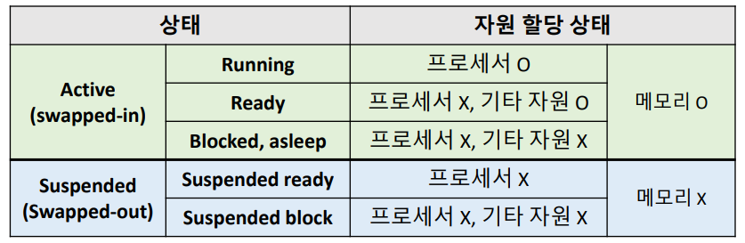
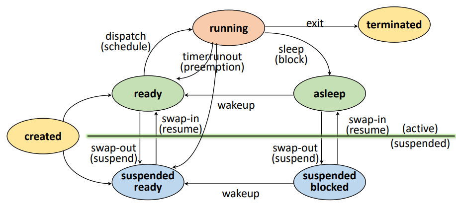
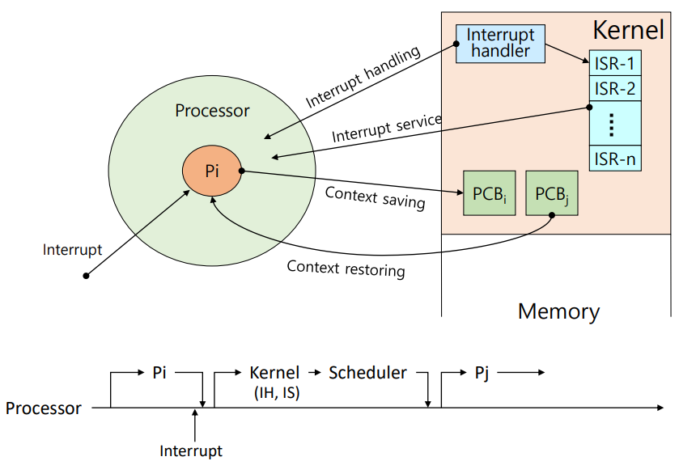

# chap3 프로세스 관리

[toc]

### 1. 프로세스의 개념

1. Job vs Process
   - Job / Program : 실행 할 프로그램 + 데이터. 컴퓨터 시스템에 **실행 요청 전 상태**
   - Process : 실행을 위해 **시스템(커널)에 등록된** 작업. 메모리를 할당 받음
2. 프로세스의 정의
   - **실행 중인 프로그램**. 커널에 등록된 Job
   - 각종 자원들을 요청하고 할당 받을 수 있는, PCB를 할당받은 개체
3. 프로세스의 종류
   - 역할에 따라 분류
     - 시스템(커널) 프로세스 : 모든 시스템 메모리와 프로세서의 명령에 액세스할 수 있는 프로세스. 프로세스 실행 순서를 제어하거나 다른 사용자 및 커널 영역을 침범하지 못하게 감시하고, 사용자 프로세스를 생성하는 기능
     - 사용자 프로세스 : 사용자 코드를 수행
   - 병행 수행 방법에 따라 분류
     - 독립 프로세스 : 다른 프로세스에 영향을 주거나 받지 않으면서 수행
     - 협력 프로세스 : 다른 프로세스에 영향을 주거나 받으면서 수행

 

 

### 2. PCB (프로세스 관리 블록)

1. 자원(Resource) : **커널의 관리 하에 프로세스에게 할당/반납**되는 수동적 객체
   - HW resource : Processor, memory, disk, monitor, etc. 
   - SW resource : Message, signal, files, installed SWs, etc.
2. Process Control Block(PCB)
   - 커널이 관리하는 영역에 저장됨. 프로세스 생성시 생성됨.
   - **각 프로세스들에 대한 상태 정보를 저장**한다. (OS 별로 PCB 정보 다름)
3. PCB가 관리하는 정보
   - PID (Process Identification Number) : 프로세스 고유 식별 번호
   - 스케줄링 정보 : 프로세스 우선순위 등과 같은 스케줄링 관련 정보들
   - 프로세스 상태 : 자원 할당, 요청 정보 등
   - 메모리 관리 정보 : Page table, segment table 등
   - 입출력 상태 정보 : 할당 받은 입출력 장치, 파일 등에 대한 정보 등
   - 문맥 저장 영역 : 프로세승의 레지스터 상태를 저장하는 공간 등
   - 계정 정보 : 자원 사용 시간 등을 관리

 

 

### 3. 프로세스 상태 변화

1. 프로세스의 상태 및 특성

   

   

2. Created State 

   - 작업을 커널에 등록 & PCB 할당 및 프로세스 생성
   - **가용 메모리 공간 체크**해서 공간이 있으면 ready, 없으면 suspended ready로 프로세스 상태 전이

3. Ready State

   - **프로세서 외에** 다른 모든 자원을 할당받은 상태 (CPU를 기다리고 있는 상태)
   - Dispatch : CPU를 할당받고 running 상태로 전이하는 것

4. Running State

   - 프로세서와 필요한 자원을 **모두 할당**받은 상태
   - Preemption : 프로세서를 뺏기고 ready state로 돌아가는 것
   - Block/sleep : 필요한 자원을 보충하기 위해 asleep state로 전이하는 것. I/O등 자원 할당 요청 및 대기

5. Blocked/Asleep State

   - 프로세서 외에 **다른 자원**을 기다리는 상태 (자원 할당은 System call에 의해 이루어 짐)
   - Wake-up : I/O가 끝났다면 바로 running 상태로 가는 게 아니라, **ready 상태로 이동한다.**

6. Suspended State

   - 메모리를 할당 받지 못한(빼앗긴) 상태
   - Memory image를 swap device(프로그램 정보 저장을 위한 특별 파일 시스템)에 보관
   - Swap-out (suspended) : 메모리를 빼앗겨서 메모리 이미지를 사진찍어 저장하는 것
   - Swap-in (resume) : 메모리를 할당받아서 메모리 이미지로 메모리 복구하는 것

7. Terminated/Zombie State

   - 프로세스 수행이 끝난 상태. 모든 자원 반납 후, 커널 내에 **일부 PCB 정보만** 남아있는 상태
   - 다음에 비슷한 작업이 들어왔을 때 프로세스 관리를 효율적으로 하기 위해 정보를 수집함

 

 

### 4. 인터럽트

1. 예상치 못 한, 외부에서 발생한 이벤트 (Unexpected, external events)

   - I/O , Clock , console , Program , Machine , Inter-process , System call interrupt

2. 인터럽트 처리 과정

   

   

   - Pi를 수행하다가 interrupt가 발생했을 때, 다음에 Pi가 다시 실행된다는 보장이 없다. Pj가 실행될 수도 있음

 

 

### 5. Context switching

1. Context : 프로세스와 관련된 정보들의 집합
   - CPU register context => in CPU
   - Code & data, stack, PCB => in memory
2. Context switching (Context saving + restoring)
   - Context saving : 현재 프로세스의 register context를 저장하는 작업
   - Context restoring : Register context를 프로세스로 복구하는 작업
   - **Context switching : 실행하던 프로세스의 context를 저장하고, 실행할 프로세스의 context를 복구**
3. Context Switch Overhead
   - Context switching에 소요되는 비용은 OS마다 다르며, 성능에 큰 영향을 준다.
   - 불필요한 context switching을 줄이는 것이 중요하다 (스레드 사용 등)

