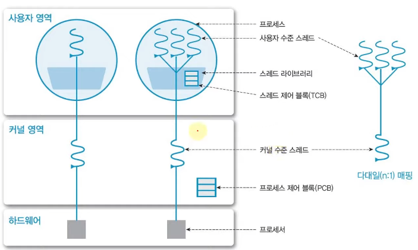
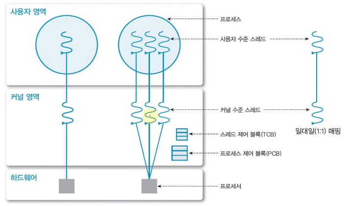
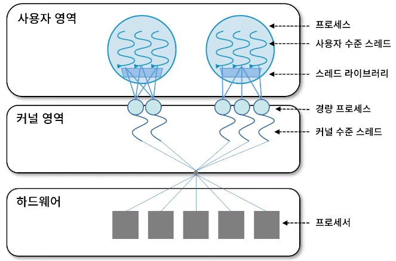

# chap4 스레드 관리

[toc]

### 1.  스레드의 개념

1. 스레드란?

   - 자원과 제어 중 **제어만** 분리해놓은 것. 
   - 하나의 프로세스 안에 스레드가 여러개 있을 수 있다 (자원은 하난데 제어가 여러개 있을 수 있음)
   - 같은 프로세스의 스레드들은 동일한 주소 공간을 공유한다.

   

2. 스레드의 특성

   - Light Weight Process (LWP) 라고도 한다. 프로세서(CPU) 활용의 기본 단위.
   - 구성 요소 : Thread ID , Register set (Program Counter, Stack Pointer 등) , Stack (local data 등)
   - 제어 요소 외 코드, 데이터 등 **자원들은 프로세스 내 다른 스레드들과 공유**

3. 스레드의 장점

   - **사용자 응답성 (Responsiveness)**
     - 일부 스레드의 처리가 지연되어도, 다른 스레드는 작업을 계속 처리 가능
     - I/O가 세개일 때 (마우스/모니터/헤드셋) , 하나의 스레드/프로세스라면 한 작업을 할 때 다른 작업이 멈춘다. 스레드가 여러 개 돌아가면서 자원도 공유하면 동시에 작업할 수 있다
   - **자원 공유 (Resource sharing)**
     - 자원을 공유해서 효율성 증가 (커널의 개입을 피할 수 있음)
     - 프로세스 1, 2가 자원 A을 번갈아서 사용한다면 context switching이 발생한다. 만약 프로세스가 아니라 스레드라면 자원 A를 공유하기 때문에 context switching이 발생하지 않는다.
   - 경제성 (Economy)
     - 프로세스의 생성, context switch에 비해 효율적
   - **멀티 프로세서 활용 (multi-processor)**
     - 병렬 처리를 통해 성능 향상
     - 스레드가 여러개라는 것은 여러개의 CPU core를 사용할 수 있다는 것 (multi core processor)

 

 

### 2. 스레드의 구현

1. 사용자 수준 스레드 (User thread)

   - 사용자 영역의 **스레드 라이브러리**로 구현 됨
     - 라이브러리가 스레드의 생성, 스케줄링을 관리 
   - 커널은 스레드의 존재를 모른다.
     - 장) 커널의 관리를 받지 않는다 : 생성/관리 부하 적고 유연한 관리. 이식성(portability)이 높음
     - 단) 커널은 프로세스 단위로 자원 할당 : 하나의 스레드가 block 상태가 되면 모든 스레드가 대기
   - 프로세스가 하나 생성되면 커널 영역에서 커널 수준 스레드 하나 생성된다. 그리고 **사용자 영역에서 스레드 라이브러리로 사용자 수준 스레드 여러개가 생성**된다. 해당 정보는 스레드 제어 블록(TCB)에 저장된다. => 사용자 수준 스레드 : 커널 수준 스레드 = n : 1 매핑

   

2. 커널 수준 스레드 (Kernel thread)

   - OS(Kernel)가 직접 관리
   - 장) 커널이 각 스레드를 개별적으로 관리 : 하나의 스레드가 block 되어도 다른 스레드는 작업 수행 가능
   - 단) 커널 영역에서 스레드의 생성, 관리하기 때문에 context switching 등 **오버헤드가 크다.**
   - 사용자 영역에서 스레드를 만들면 그에 맞춰서 커널 수준 스레드를 만든다. 해당 정보는 스레드 제어 블록(TCB)에 저장된다. => 사용자 수준 스레드 : 커널 수준 스레드 = 1 : 1 매핑

   

3. Multi-Threading Model

   - n:1 모델 : 사용자 수준 스레드

   - 1:1 모델 : 커널 수준 스레드

   - n:m 모델 : 혼합형 스레드. 효율적이고 유연!

     - 사용자 수준 스레드 n > 커널 스레드 m : 사용자는 원하는 수 만큼 스레드 사용
     - 커널 스레드는 자신에게 할당된 한 사용자 스레드가 block되어도 다른 스레드 수행 가능 (병행 처리)

     

