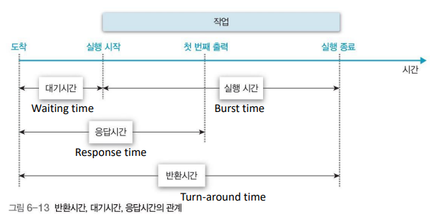
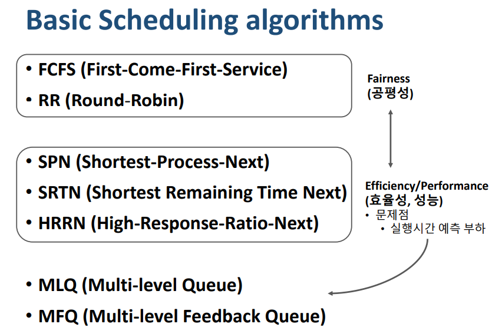
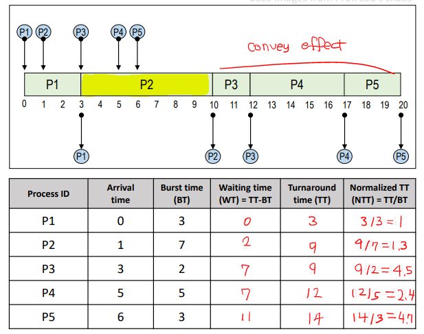
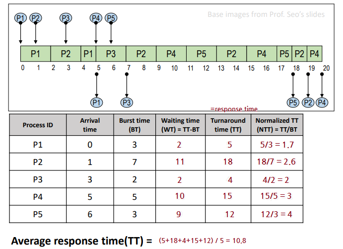
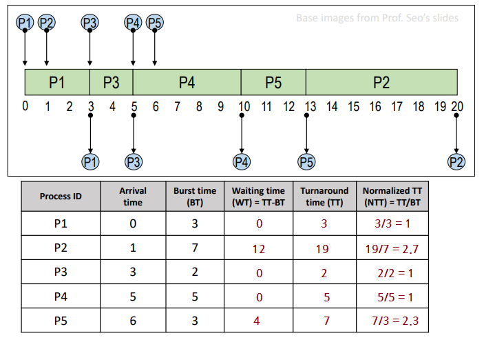
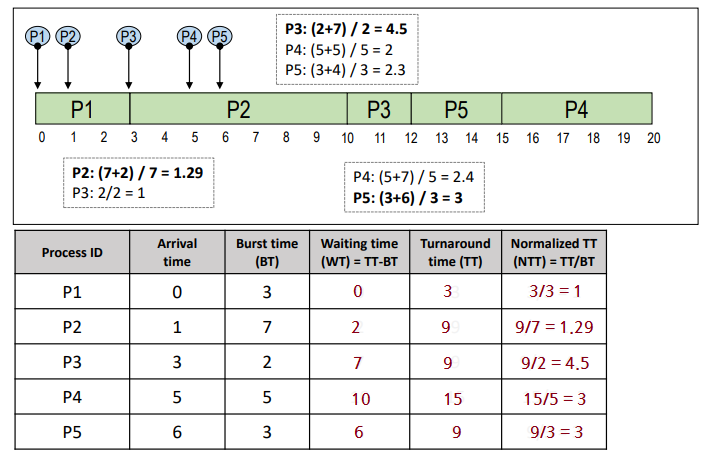
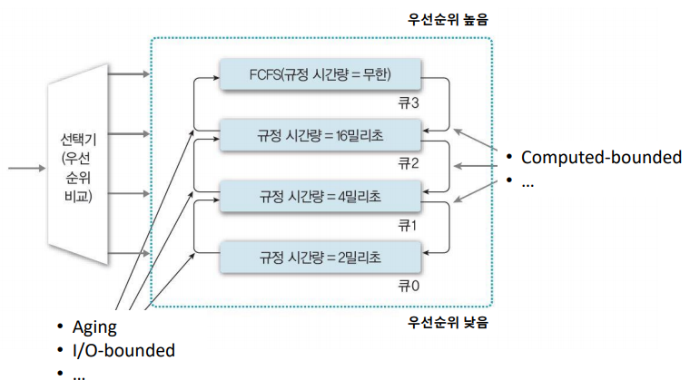

# chap5 프로세스 스케줄링

[toc]

### 1. 스케줄링의 목적

1. 다중 프로그래밍 : 여러개의 프로세스가 시스템 내 존재. **자원을 할당할 프로세스를 선택**해야 함.

   - 시간 분할 자원 관리
     - 하나의 자원을 여러 스레드들이 **번갈아가며 사용** (ex. 프로세서)
     - 프로세스 스케줄링 : 프로세서 사용 시간을 프로세스들에게 분배
   - 공간 분할 자원 관리
     - 하나의 자원을 **분할하여 동시에 사용** (ex. 메모리)

2. 스케줄링의 목적 : 시스템의 성능 향상

   - 시스템 성능 지표 (index)
     - 응답 시간 (response time) : 작업 요청(submission)으로부터 응답을 받을 때까지의 시간
     - 작업 처리량 (throughput) : 단위시간 동안 완료된 작업의 수 
     - 자원 활용도 (resource utilization) : 주어진 시간(Tc)동안 자원이 활용된 시간(Tr) . Tr/Tc
     - 기타 : 공평성, 실행 대기 방지, 예측 가능성 등
   - **목적에 맞는 지표를 고려**하여 스케줄링 기법을 선택한다.
     - 응답 시간 : interactive system (사용자 대화형 시스템), real-time system
     - 작업 처리량 : batch system (일괄처리 시스템)
     - 자원 활용도 : 비싼 자원을 사용할 때

3. 대기시간, 응답시간, 반환시간

   

 

 

### 2. 스케줄링 기준 및 단계

1. 스케줄링 기법이 고려하는 항목들

   - 프로세스의 특성 (I/O-bounded or compute-bounded)
     - `CPU burst` vs `I/O burst`
       - 프로세스 수행시간 = CPU 사용 시간 (CPU burst) + I/O 대기 시간 (I/O burst)
       - CPU burst가 더 길 때 : computed-bounded . 연산에 의해서 성능이 좌지우지 된다.
       - I/O burst가 더 길 때 : I/O-bounded . I/O에 의해서 성능이 좌지우지 된다.
   - 시스템 특성 (batch system or interative system)
   - 프로세스의 긴급성 (Hard- or soft- real time, non-real time system)
   - 프로세스 우선순위
   - 프로세스 총 실행 시간

2. 스케줄링의 단계 (발생 빈도 및 할당 자원에 따라)

   - Long-term scheduling 
     - Job scheduling : 시스템에 제출 할 **(kernel에 등록 할) 작업** 결정
     - 다중 프로그래밍 정도(degree) 조절 : 시스템 내에 **프로세스 수** 조절
     - I/O bounded 와 compute-bounded 프로세스들을 잘 섞어서 선택 : 시스템 효율을 위해서
     - 시분할 시스템에서는 모든 작업을 시스템에 등록하기에 Long-term scheduling이 덜 중요
   - Mid-term scheduling
     - 메모리 할당 결정 (memory allocation)
   - Short-term scheduling
     - Process scheduling : 프로세서를 할당한 프로세스를 결정
     - 가장 빈번하게 발생 : interrupt, block (I/O), time-out, etc. **매우 빨라야 함**

   

 

 

### 3. 스케줄링 정책(Policy)

1. Preemptive(선점) vs Non-preemptive(비선점) 스케줄링
   - Preemptive : 타의에 의해 자원을 빼앗길 수 있음 (할당시간 종료, 우선순위 높은 프로세스 등장)
     - 장) 응답성이 높음 (Time-sharing system, real-time syatem 등에 적합)
     - 단) Context switch overhead가 큼
   - Non-Preemptive : 할당받을 자원을 **스스로 반납할 때까지** 사용 (뺏기지 않음. system call, I/O 등)
     - 장) Context switch overhead가 적음
     - 단) 잦은 우선순위 역전(우선순위 높은 일을 먼저 처리 못 함), 평균 응답시간 증가
2. 우선순위
   - Static priority (정적 우선순위) : 프로세스 생성시 결정된 priority가 유지
     - 장) 구현이 쉽고, overhead가 적음
     - 단) 시스템 환경 변화에 대한 대응이 어려움
   - Dynamic priority (동적 우선순위) : 프로세스 상태 변화에 따라 priority가 변경
     - 장) 시스템 환경 변화에 유연한 대응 가능
     - 단) 구현이 복잡, priority 재계산 overhead가 큼 

 

 

### 4. 기본 스케줄링 알고리즘들

 

1. FCFS (First-Come-First-Service)

   - Non-preemptive scheduling
   - 스케줄링 기준 : **도착 시간 (ready queue 기준)**. 먼저 도착한 프로세스를 먼저 처리
   - Batch system에 적합, interative system, 대화형 시스템에 부적합
   - 장) 자원을 효율적으로 사용 가능 : 도착한 대로 프로세서에게 할당하면 돼서 불필요한 스케줄링 오버헤드 X
   - 단) 긴 평균 응답 시간. Convoy effect (하나의 수행시간이 긴 프로세스에 의해 다른 프로세스가 긴 대기시간을 갖게 되는 현상)

   

   - NTT : 써야하는 Burst time 대비 얼마나 기다렸는가 ? 1이면 이상적이고, 1보다 클수록 더 오래 기다렸다고 평가된다. 불공정.

2. RR (Round-Robin)

   - Preemptive scheduling
   - 스케줄링 기준 : **도착 시간 (ready queue 기준)**. 먼저 도착한 프로세스를 먼저 처리
   - **자원 사용 제한 시간(Time quantum)**이 있음 : 프로세스는 할당된 시간이 지나면 자원을 반납
     - 장) 특정 프로세스의 독점을 방지 & 단) Context switch overhead가 크다.
     - 제한 시간이 무한대가 되면 FCFS가 되고, 0에 가까워지면 프로세서를 동시에 쓰는 느낌을 준다.
   - 대화형, 시분할 시스템에 적합

   

3. SPN (Shortest-Process-Next)

   - Non-preemptive scheduling
   - 스케줄링 기준 : **실행 시간 (burst time 기준)**. 실행시간이 작은 프로세스를 먼저 처리
   - 장) 평균 대기시간 최소화. 시스템 내 **프로세스 수 최소화** (스케줄링 부하 감소, 메모리 절약, 시스템 효율 향상) , 많은 프로세스들에게 **빠른 응답 시간** 제공
   - 단) **Starvation**(무한대기, BT가 길면 자원 할당 못 받을수도) 현상 발생. 정확한 실행시간을 알 수 없음

   

4. SRTN (Shortest Remaining Time Next) : SPN 변형

   - preemptive scheduling : 잔여 실행 시간이 더 적은 프로세스가 ready 상태가 되면 선점
   - 장) SPN의 장점 극대화
   - 단) 프로세스 생성시 총 실행 시간 예측이 필요. 잔여 실행 시간을 계속 추적해야 함(overhead), context switching overhead => 구현 및 사용이 비현실적

5. HRRN (High-Response-Ratio-Next) : SPN 변형

   - Non-preemptive scheduling, SPN + **Aging concepts**
     - Aging concepts : 프로세스의 대기 시간(WT)을 고려
   - 스케줄링 기준 : response ratio = (WT+BT) / BT 가 높은 프로세스 우선
     - SPN 장점 + starvation 방지. but, 실행시간 예측 기법 필요 (overhead)

   

6. MLQ (Multi-level Queue)

   - 작업(or 우선순위) 별 별도의 ready queue가 존재
     - **최초 배정된 queue**를 벗어나지 못한다. **각각의 queue는 자신만의 스케줄링 기법** 사용
     - Queue 사이에는 우선순위 기반의 스케줄링 사용
   - 장) 우선순위가 높은 프로세스는 빠르게 응답시킬 수 있다.
   - 단) 여러 개의 queue 관리 등 스케줄링 overhead . 우선순위가 낮은 queue는 starvation 현상 발생 가능 

   

7. MFQ (Multi-level Feedback Queue)

   - **Queue간 이동이 허용**된 MLQ. feedback을 통해 우선순위 조정
   - 장) 프로세스에 대한 사전 정보 없이 SPN, SPTN, HRRN 기법의 효과를 볼 수 있음
   - 단) 설계 및 구현이 복잡. 스케줄링 overhead가 큼. starvation 문제 등
   - 변형
     - 프로세스 특성에 맞게 각 준비 큐마다 시간 할당량을 다르게 배정
     - 입출력 위주 프로세스들을 상위 단계의 큐로 이동, 우선순위 높임 (프로세스가 block될 때 상위의 준비 큐로 진입하게 함. 시스템 전체 평균 응답 시간을 줄이고 입출력 작업 분산 시킴)
     - 대기 시간이 지정된 시간을 초과한 프로세스들을 상위 큐로 이동 (aging 기법)

   

