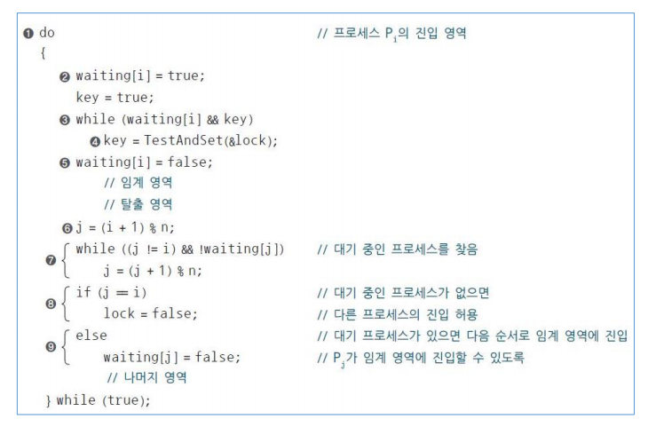
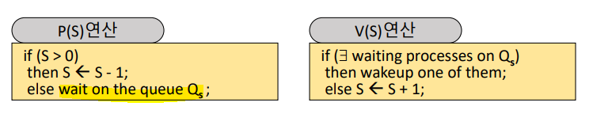

# chap6 프로세스 동기화 & 상호배제

[toc]

### 1. 프로세스 동기화 & 상호 배제

1. 동기화 : 프로세스들이 서로 동작을 맞추고, 정보를 공유하는 것.
   - 비동기적 : 프로세스들이 서로에 대해 모름
   - 병행적 : 여러개의 프로세스들이 동시에 시스템에 존재
   - 병행 수행중인 비동기적 프로세스들이 **공유 자원에 동시 접근할 때** 문제 발생 가능
2. 용어 정리
   - Shared data (공유 데이터 or Critical data) : 여러 프로세스들이 공유하는 데이터
   - Critical section (임계 영역) : 공유 데이터를 접근하는 코드 영역
   - Mutual exclusion (상호배제) : 둘 이상의 프로세스가 **동시에 critical section에 진입하는 것을 막는** 것
   - Race condition (경쟁 상태) : 공유 데이터에 동시에 접근할 때 **실행 순서에 따라 결과가 달라지는** 것 
3. Mutual exclusion (상호 배제) Methods
   - Mutual exclusion primitives (기본 연산)
     - enterCs() primitive : Critical section 진입할 때, 다른 프로세스가 cs 안에 있는지 검사
     - exitCs() primitive : Critical section을 벗어날 때, cs를 벗어났다고 시스템이 알림
   - Mutual exclusion primitives 을 위한 필수 조건
     - `Mutual exclusion (상호배제)` : cs에 프로세스가 있으면 다른 프로세스 진입 금지
     - `Progress (진행)` : **cs안에 있는 프로세스 외에는 다른 프로세스가 cs에 진입하는 것을 방해하면 안 됨**. cs가 비어있으면 진입할 수 있어야 함
     - `Bounded waiting (한정대기)` : 프로세스의 cs진입은 유한시간 내에 허용되어야 함

<br/>

<br/>

### 2. 상호배제 : SW solutions

1. Two process ME

   - Dekker's Algorithm : Two process ME를 보장하는 최초의 알고리즘

   

   - Perterson's Alogorithm : Dekker's algorithm 보다 간단하게 구현

   

2. Dijkstra's Algorithm : 최초로 프로세스 n개의 상호배제 문제(N-process ME)를 해결 

   - flag 변수
     - idle : 프로세스가 임계 지역 진입을 시도하고 있지 않을 때
     - want-in : 프로세스가 임계 지역 진입 시도 1단계 일 때
     - in-CS : 프로세스의 임계 지역 진입 시도 2단계 및 임계 지역 내에 있을 때

   

3. SW solution의 단점

   - 속도가 느림. 구현이 복잡. **busy waiting** 문제 O (비효율적)
   - ME primitive 실행 중 preemption 될 수 있음 : 공유 데이터 수정 중은 interrupt를 억제하여 해결 가능

<br/>

<br/>

### 3. 상호배제 : HW solutions

1. TestAndSet (TAS) instruction : Test와 Set을 한 번에 수행하는 기계어

   - 실행 중 interrupt를 받지 않음 **(preemption 되지 않음)**

   ```c
   // target을 검사하고 target 값을 true로 설정 => 코드가 한 번에 수행 !! 
   boolean TestAndSet (boolean *target) {
       boolean temp = *target;    // 이전 값 기록
       *target = true;            // true로 설정
       return temp;               // 값 반환
   }
   ```

   

   - 1번은 cs에 들어가고, 2 3번이 while문에서 대기중이라면 다음에 들어갈 프로세스는? 순서를 확정할 수 없으니 3번이라고 해보자. 그럼 3번이 cs에 들어가고 이후 4번이 와서 2 4 번이 while문에서 대기중이라면, 그리고 다음으로 4번이 cs에 들어간다면 ? 2번은 무한 대기로 빠질 수 있다. 따라서 bounded waiting 조건에 위배된다.

2. N-Process mutual exclusion

   

3. HW solution의 장단점

   - 장) 구현이 간단 & 단) Busy waiting 문제 O (을 해결하기 위해 semaphore)

<br/>

<br/>

### 4. 상호배제 : OS supported SW solutions

1. Spinlock

   - 정수 변수. 초기화, P(), V() 연산으로만 접근 가능 : 해당 연산들은 OS가 실행을 보장해준다.
   - 멀티 프로세서 시스템에서만 사용 가능. Busy waiting 문제 O

   ```
   // 물건을 꺼내가는 행동
   P(S) {
     while (S <= 0) do
     endwhile;
     S = S-1;
   }
   
   // 물건을 돌려주는 행동
   V(S) {
     S = S+1;
   }
   ```

   

2. Semaphore

   - 음이 아닌 정수형 변수 S. 초기화 연산, P(Probern, 검사), V(Verhogen, 증가)로만 접근이 가능

     - Spinlock과 차이 : 세마포어는 **임의의 s 변수 하나에 ready queue 하나가 할당, Busy waiting 해결** 
     - 세마포어는 물건이 없으면 while문으로 돌지 않고 대기실(queue)에서 기다린다.
     - 세마포어 queue에 대한 **wake-up 순서는 비결정적** => starvation problem
     - 모두 indivisible 연산. OS가 이를 도와준다.

     

   - semaphore 의 종류

     - Binary semaphore : s 가 0, 1 두 종류. 상호배제나 프로세스 동기화의 목적으로 사용
     - Counting semaphore : s가 0 이상의 정수 값. Producer-Consumer 문제 등을 해결하기 위해 사용

   - **세마포어로 해결 가능한 동기화 문제**

     - 상호배제 문제 : spinlock과 동일하게 P, V를 넣어 해결 가능

     - 프로세스 동기화 문제 : 병행, 비동기적 프로세스 두 개가 있을 때 A 다음에 B가 실행되도록 순서를 맞추고 싶다. 그러면, B프로세스는 원하는 순간에 queue 대기실에 들어가서 기다리고, A 프로세스가 끝난 후 B를 깨워주면 된다. 그러면 그 이후 B가 진행된다.

     - Producer-Consumer (생산자-소비자) 문제 : 생산자 (메시지를 생산) , 소비자 (메시지를 전달) . 

       

       

       

     - Reader-writer 문제 : Reader (데이터 읽기만 수행) , Writer (데이터 갱신 수행)

       - 데이터 무결성 보장 필요 : Reader (동시 데이터 접근 O) , Writer (동시 데이터 접근 상호배제 필요)
       - reader / writer 에 대한 우선권 부여 : reader1이 읽고 있어서 writer가 못 쓰는 중. 그런데 그 와중에 reader2가 오고, reader1은 가버리면 writer는 reader2보다 먼저 왔는데도 못 쓰게 됨

       

     - Dining philosopher (철학자들의 저녁 식사) 문제

3. Eventcount/sequencer (은행 번호표와 비슷)

   - **busy waiting X , starvaion X , 세마포어보다 더 low-level control (순서 컨트롤) 가능**

   - 정수형 변수 S(Sequencer). 생성시 0으로 초기화, 감소 X. **발생 사건들의 순서 유지**. ticket() 연산만 접근O

     - ticket(S) : 현재까지 ticket()연산이 호출된 횟수를 반환. indivisible operation

   - 정수형 변수 E(Eventcount). 생성시 0으로 초기화, 감소X. **특정 사건의 발생 횟수 기록**. 아래 연산만 접근O

     -  read(E) : 현재 Eventcount 값 반환
     - advance(E) : E <- E+1. E를 기다리고 있는 프로세스를 깨움(wake-up)
     - await(E, v) : V는 정수형 변수. if (E < v) 이면 E에 연결된 큐에 프로세스 전달 및 CPU 스케줄러 호출

   - 해결 가능한 동기화 문제 

     - Mutual exclusion

       

     - Producer-Consumer problem

       

<br/>

<br/>

### 5. 상호배제 : Language-Level solution

1. Monitor : 공유데이터 + Critical section의 집합

   - 모니터의 장단점

     - 장) 사용이 쉽다. Deadlock 등 error 발생 가능성이 낮다.
     - 단) 지원하는 언어에서만 사용 가능. 컴파일러가 OS를 이해하고 있어야 함.

   - Monitor의 구조

     - Entry queue (진입 큐) : 모니터 내의 procedure 수 만큼 존재
     - Mutual exclusion : 모니터 내에는 **항상 하나의 프로세스만 진입 가능**
     - Informaion hiding (정보 은폐) : 공유 데이터는 모니터 내의 프로세스만 접근 가능
     - Condition queue (조건 큐) : 모니터 내의 특정 이벤트를 기다리는 프로세스가 대기
     - Signaler queue (신호제공자 큐) : 모니터에 항상 하나의 신호 제공자 큐가 존재. signal() 명령을 실행한 프로세스가 임시 대기.

   - 자원 할당 문제

     

     

   - Producer-Consumer Problem

     

     

   - Reader-Writer Problem

     

   - Dining philosopher problem

     - 철학자들은 생각하는 일, 스파게티 먹는 일만 반복함

     - 공유 자원 : 스파게티, 포크. 스파게티를 먹기 위해서는 좌우 포크 2개 모두 들어야 함

       

     

