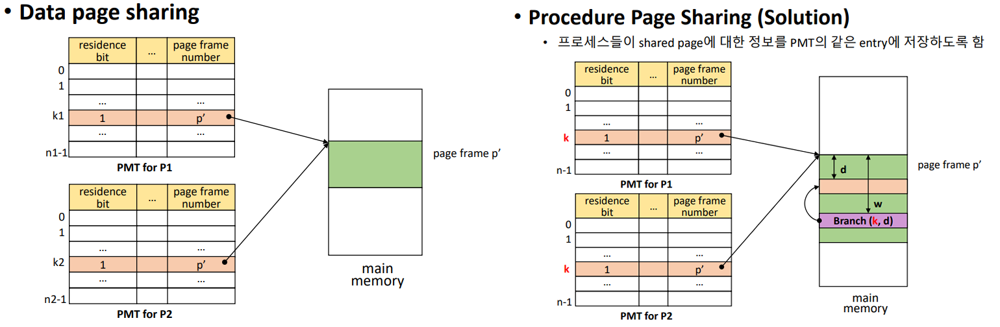
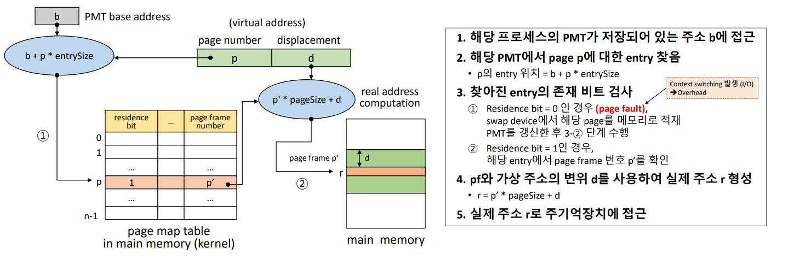
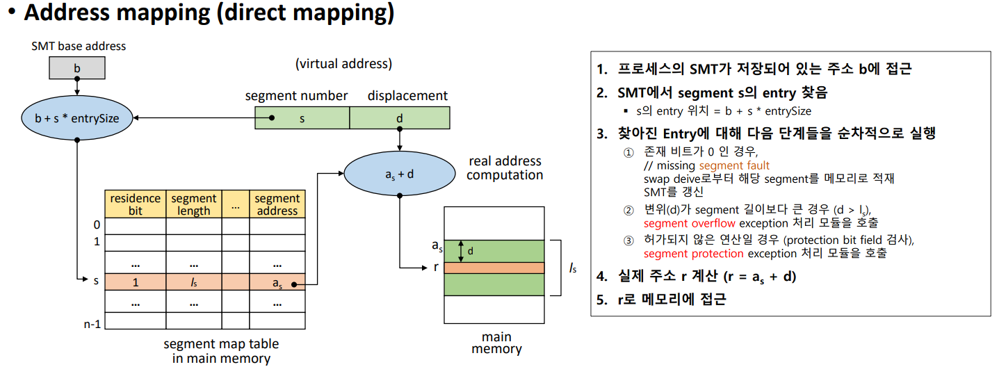
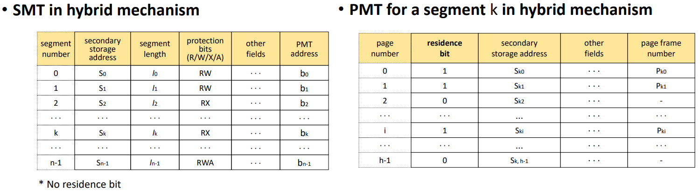

## chap9 메모리 관리 (비연속 할당)

[toc]

### 1. Non-continuous allocation

1. 비연속 메모리 할당

   - **사용자 프로그램을 여러개의 block으로 분할**
   - 실행 시, **필요한 block만** 메모리에 적재 (나머지 block 들은 swap device에 존재)
   - 기법들 : Paging system, Segmentation system, Hybrid paging/segmetation system

2. Address mapping

   - Continuous allocation : relation address (상대 주소) & Relocation (재배치)
   - Non-continous allocation
     - Virtual address (가상 주소) : logical address (논리 주소), **연속된 메모리 할당을 가정**
     - Real (=absolute, physical) address (실제 주소) : 실제 메모리에 적재된 주소
     - 비연속 메모리 할당에서 주소 매핑 : Virtual address => real address (Block mapping)

3. Block mapping

   - 사용자 프로그램을 **block** 단위로 분할/관리. 각 block에 대한 address mapping 정보 유지
   - Virtual address : v = (b, d)
     - b = block number & d = displacement(offset) in a block
   - Block map table (BMT)
     - Address mapping 정보 관리. 커널 공간에 프로세스마다 하나의 BMT
     - Residence bit : 해당 블록이 메모리에 적재되었는지 여부 (0 or 1)

   

 

 

 

### 2. Paging system

1. Paging system : 프로그램을 **같은 크기의 블록**으로 분할

   - Page : 프로그램의 분할된 block. 이들은 Secondary storage(Swap device, 가상메모리) 에 들어있다.
   - Page frame : 메모리의 분할 영역, **Page와 같은 크기로** 분할

2. 특징

   - 장) 간단, 효율적 (Segmentation 보다)
   - 단) 논리적 분할 X 크기 분할 : Page sharing(2-4) 및 protection(2-5) 과정이 복잡 (Segmentation 보다)
   - External fragmentation 발생 X , Internal fragmentation 발생 가능
   - Windows page size = 4KB (시스템에 따라 상이)

3. 메모리 관리

   - Page와 같은 크기로 미리 분할하여 관리/사용

   - Frame table : Page frame 당 하나의 entry

     - 구성 필드: Allocated/available, PID, Link(사용 가능한 frame page들을 연결, 연결 리스트 형태)
     - AV : free list의 시작점. 가장 첫 번째 비어있는 frame page를 가리킨다.

     

4. Page sharing

   - 여러 프로세스가 특정 page를 공유 가능

   

   - 공유 가능 page
     - Procedure pages : Pure code (reenter code)
     - Data page : Read-only data, Read-write data (R/W는 병행성 제어 기법 관리 하에서만)
   - Data page sharing
   - Procedure Page sharing 
     - 문제 : 지칭하는 shared page number가 다르면 문제가 생길 수 있다.
     - 해결 : 프로세스들이 shared page에 대한 정보를 PMT의 같은 entry에 저장한다.

   

5. Page Protection

   - 여러 프로세스가 page를 공유할 때 **Protection bit 사용**한다. 

   

 

 

 

### 3. Paging system의 Address mapping

1. Address mapping

   - Virtual address : v = (p, d)
     - p : page number & d : displacement(offset)
   - PMT (Page Map Table) 사용
     - 구성 : Page number, residence bit, scondary storage address, page frame number 등
   - Address mapping mechanism
     - Direct mapping (직접 사상) 
     - Associative mapping (연관 사상)
     - Hybrid direct/associative mapping

2. Direct mapping (직접 사상)

   - Block mapping과 유사.
   - 가정 1) PMT를 커널 안에 저장. 2) PMT entry size = entrySize. 3) Page size = pageSize
   - **page fault** : Residence bit = 0인 경우.  **Context switching을 발생**시키고, 오버헤드가 크다. 

   

   - 문제점과 해결방안

     - **메모리 접근 횟수가 2배 : 성능 저하** => Associative mapping (TLB)

     - PMT를 위한 메모리 공간 필요 => PMT를 위한 전용 기억장치(공간) 사용

3. Associative mapping (연관 사상)

   - **TLB (Transloation Look-aside Buffer)**에 PMT 적재
     - 전용 HW. page number를 주면 TLB 안의 PMT를 병렬 탐색해서 page frame number를 바로 준다.
     - Associative high-speed memory
   - 장) PMT를 병렬 탐색. 낮은 오버헤드, 높은 속도
   - 단) 비싸다. => 작음. 즉, 큰 PMT를 다루기가 어려움

4. Hybrid direct/associative mapping (두 기법 혼합)

   - 작은 크기의 TLB 사용

     - PMT : 메모리 (커널 공간)에 저장 & TLB : PMT 중 **일부 entry**를 적재
     - **Locality(지역성)** 활용 : 프로그램의 수행 과정에서 한 번 접근한 영역 혹은 인접 영역을 재접근할 가능성 ↑

   - 프로세스의 **PMT가 TLB에 적재되어 있는지 확인**하는 과정 추가

     - 적재 O : residence bit를 검사하고, page frame number 확인
     - 적재 X : Direct mapping으로 page frame number 확인 후 해당 PMT entey를 TLB에 적재

     

 

 

 

### 4. Segmentation system

1. Segment : 프로그램을 **논리적 block**으로 분할. 메모리를 **동적으로 분할**

   - block의 크기가 서로 다를 수 있다. ex) stack, heap, main procedure, shared lib 등
   - 특징
     - 메모리를 **미리 분할하지 않음** (VPM과 유사)
     - Segment sharing/protection이 용이
     - Adress mapping 및 메모리 관리의 **오버헤드가 크다**
     - Internal fragmentation 발생 X , External fragmentation 발생 가능

2. Address mapping

   - Virtual address : v = (s, d)

     - s : segment number & d : displacement in a segment

   - Segment Map Table (SMT)

     - PMT 과 공통 : segment number, residence bit, secondary storage address , segment address
     - 추가 : segment length , protection bits (R/W/X/A)

   - Address mapping mechanism : Paging system과 유사

     - Direct mapping : paging기법과 동일
       - **segment fault** : 존재 비트가 0 인 경우
       - **segment overflow** : segment 크기보다 클 때
       - **segment protection** : protection bit field를 검사하고 권한이 허용됐는지 판단

     

3. 메모리 관리

   - VPM 과 유사. segment 적재 시, 크기에 맞추어 **분할 후 적재**

4. Segment sharing / protection

   - 논리적으로 분할되어 있어, 공유 및 보호가 용이함

   

5. Paging vs. Segmentation

   - Paging system
     - 장점 : 간단, 낮은 오버헤드
     - 단점 : No logical concept for partitioning , 복잡한 page sharing mechanism
   - Segmentation System
     - 장점 : Logical concept for partitioning , 간단하고 쉬운 sharing mechanism
     - 단점 : 높은 관리 오버헤드

 

 

 

### 4. Hybrid paging/segmentation system

1. Paging 과 Segmentation의 장점 결합

   - 프로그램 분할 : 논리 단위의 **segment 분할** + 각 segment를 **고정된 크기의 page**들로 분할
     - 장) Page sharing/protection이 쉬움, 메모리 할당/관리 오버헤드가 작음, 외부 단편화 X
     - 단) 전체 테이블 수 증가 => 메모리 소모 큼. address mapping 과정 복잡
   - page 단위로 메모리에 적재

2. Address mapping

   - Virtual address : v = (s, p, d)

     - s : segment number & p : page number & d : offset in a page

   - SMT와 PMT 모두 사용 

     - 각 프로세스마다 하나의 SMT : **residence bit X , PMT address O**
     - 각 segment 마다 하나의 PMT : residence bit O

     

   - Address mapping : Direct , associated 등

     - Direct (address) mapping : 단) **메모리 접근 3배**, 성능 저하 => TLB 사용으로 해결 가능 

     

3. 메모리 관리 : FPM과 유사

