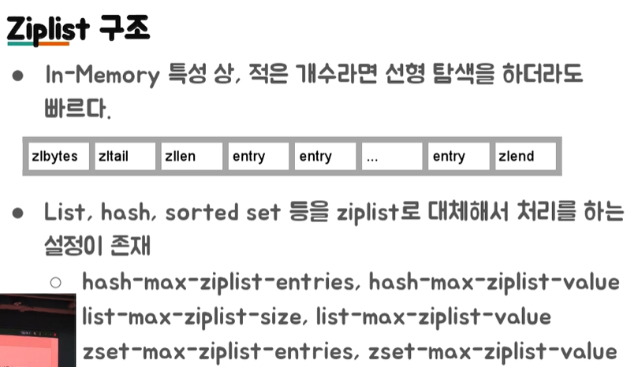
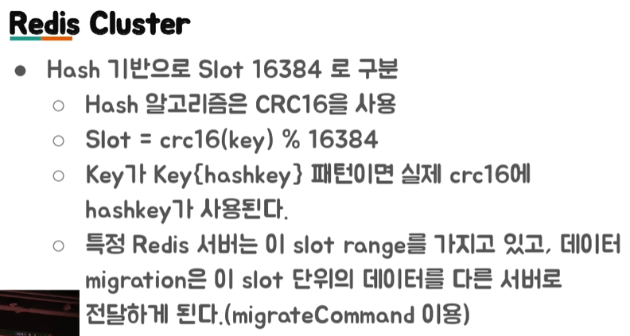
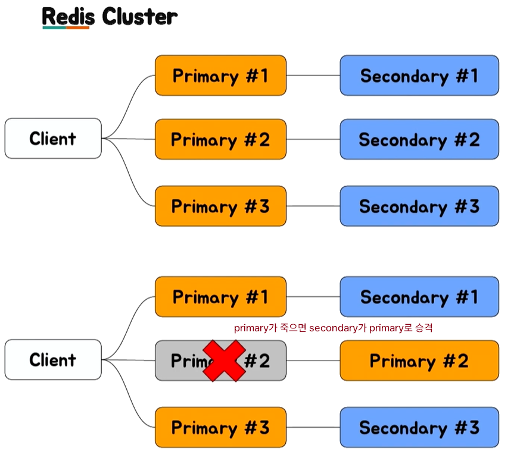

# 우아한 Redis

https://www.youtube.com/watch?v=mPB2CZiAkKM

## 1. Redis 소개

1. Redis 소개

   - In-Memory Data Structure Store

   - Open Source(BSD 3 License)
     - Support data structures
       - Strings, set, sorted-set, hashes, list
       - Hyperloglog, bitmap, geospatial index
       - Stream

   - Only 1 Committer

2. Cache

   - Cache는 나중에 요청올 결과를 **미리 저장해두었다가 빠르게 서비스** 해주는 것을 의미

   - CPU Cache : Redis는 Memory에 위치

     

3. Cache 구조

   - Memory Cache를 이용하면 더 빠른 속도로 서비스 가능  
   - Look aside Cache 방식
     - 클라이언트 요청 → **서버에서 데이터가 존재하는지 Cache를 연계 확인** → Cache에 데이터가 있으면 Cache에서 가져온다 or Cache에 없으면 DB에서 알아온다 → DB에서 가져온 데이터를 Cache에 다시 저장한다.
   - Write Back 방식
     - 클라이언트 요청 → 서버는 모든 데이터를 Cache에만 저장 → Cache에는 특정 시간동안의 데이터가 저장된다 → Cache에 있는 데이터를 DB에 저장한다 → DB에 저장된 데이터를 삭제한다.
     - 장점) DB에 insert 할 때 1개씩 500번 하는 것 보다, 500개를 1번 하는 것이 훨씬 빠르다.
     - 단점) 꺼지면 Cache에 있는 데이터가 날라간다. 즉, 장애가 생겼을 때 DB에 저장되기 전 데이터가 날라갈 수 있다.

<br/>

## 2. 왜 Collection이 중요한가?

1. Memcached는 collection 지원 X, Redis는 Collection 지원 O

   - Collection => 개발의 편의성, 개발의 난이도
   - C와 Python을 비교하자. Python에서는 map같은 라이브러리 지원이 잘 되지만 C는 직접 만들어야한다. 여기서 Memcached는 C에 대응하고, Redis는 Python에 대응한다. Redis는 만들어진 것을 갖다 쓸 수 있다.

2. 개발의 편의성 - 랭킹 서버를 직접 구현한다면?

   - 가장 간단한 방법 : DB에 유저의 Score를 저장하고, order by로 정렬 후 읽어오기
     - 문제 : 개수가 많아지면 속도에 문제가 발생 (결국 디스크 사용하므로)
     - 따라서, In-Memory 기준으로 랭킹 서버의 구현이 필요함
   - Redis의 Sorted Set을 이용하면 쉽게 구현 가능함 (+Replication도 가능)
     - 단점은 가져다 쓰면 거기 한계에 종속적이 됨
     - 랭킹에 저장해야할 id가 1개당 100byte라고 할 때, 10명 1K, 10000명 1M, 10000000명 1G 

3. 개발의 난이도 - 친구 리스트 관리

   - 친구 리스트 Key/Value 형태로 저장해야 한다면? => acid & Race Condition 문제 발생 가능

   

   

   - Redis의 경우 자료구조가 Atomic 하기 때문에 해당 Race Condition을 피할 수 있다.

4. 왜 Collection이 중요한가?

   - 외부의 Collection을 잘 이용하는 것으로, 여러가지 개발 시간을 단축시키고 문제를 줄여줄 수 있기 때문에 Collection이 중요하다

5. Redis 사용처

   

<br/>

## 3. Redis Collections

1. Redis Collecitons

   - **String** : key - value 구조

   - List : List 형태. 앞이나 뒤에 데이터 넣을 땐 빠른데 중간에 넣을 땐 느리다

   - Set : Set 형태. 중복된 데이터 방지하려고

   - **Sorted Set** : 순서가 있는 Set. ranking을 구현할 때 사용

   - Hash

2. String - 단일 Key

   - 기본 사용법
     - `Set <key> <value>` : 하나 저장
     - `Get <Key>` : 하나 값 가져오기
   - prefix를 붙인다. 왜냐면 토큰인지 뭔지 구분하기 위해서.
     - Set token:1234567 abcdefghi
     - Get token:1234567

3. Strings - 멀티 Key

   - 기본 사용법
     - `mset <key1> <value1> <key2> <value2>` : 여러 개 저장
     - `mget <key1> <key2>` : 여러 개 값 가져오기
   - 단일 key와 동일하게 prefix를 붙인다.

4. List

   - 기본 사용법 (insert)
     - `Lpush <key> <A>` => key: (A)
     - `Rpush <key> <B>` => Key: (A, B)
     - `Lpush <Key> <C>` => Key: (C, A, B)
     - `Rpush <key> <D, A>` => Key: (C, A, B, D, A)
   - 기본 사용법 (pop)
     - Key: (C, A, B, D, A)
     - `LPOP <key>` => Key: (A, B, D, A)
     - `RPOP <key>` => Key: (A, B, D)
     - `RPOP <key>` => Key: (A, B)
     - Key:()
     - `LPOP <key>` => No data
     - `BLPOP <key>` => 누가 데이터를 Push 하기 전까지 대기

5. Set : 데이터가 있는지 없는지만 체크하는 용도

   - 기본 사용법
     - `SADD <key> <Value>` : Value가 이미 Ket에 있으면 추가 X
     - `SMEMBERS <key>` : 모든 Value를 돌려 줌
     - `SISMEMBER <key> <value>` : Value가 존재하면 1, 없으면 0
   - 특정 유저를 Follow 하는 목록을 저장할 때

6. Sorted Sets : 랭킹에 따라서 순서가 바뀌길 바란다면

   - 기본 사용법
     - `ZADD <key> <Score> <Value>` 
       - Value가 이미 Key에 있으면 해당 Score로 변경
       - Score값을 기준으로 정렬
     - `ZRANGE <key> <StartIndex> <EndIndex>`
       - 해당 Index 범위 값을 모두 돌려 줌
       - Zrange testkey 0 -1 : 모든 범위를 가져 옴
   - Sorted Sets의 score는 **double 타입(실수형)이기 때문에 값이 정확하지 않을 수 있다**. JS와 같이, 아주 큰 수의 경우 제대로 표현되지 않는 경우가 있다. 어떤 정수는 실수에서 표현이 되지 않는다. JS에서도 큰 id 수를 보내야할 때는 정수형이 아니라 string형태로 보내야한다. 

   ```
   - 정렬이 필요한 값
   
   select * from rank order by score limit 50, 20;
   => zrange rank 50 70
   
   select * from rank order by score desc limit 50, 20;
   => zrevrange rank 50 70
   
   
   - Score 기준으로 뽑고 싶을 때
   select * from rank where score >= 70 and score < 100;
   => zrangebyscore rank 70 100
   select * from rank where score > 70;
   => zrangebyscore rank (70 +inf
   ```

7. Hash : Key 밑에 Sub key가 존재

   - 기본 사용법
     - `Hmset <key> <subkey1> <value1> <subkey2> <value2>`
     - `Hgetall <key>` : 해당 key 의 모든 subkey와 value를 가져옴
     - `Hget <key> <subkey>`
     - `Hmget <key> <subkey1> <subkey2> ... <subkeyN>`

8. Collection 주의 사항

   - 하나의 컬렉션에 너무 많은 아이템을 담으면 좋지 않음
     - 10000개 이하 몇 천개 수준으로 유지하는 것이 좋다
   - Expire는 Collection의 item 개별로 걸리지 않고 전체 Collection에 대해서만 걸림
     - 해당 10000개의 아이템을 가진 Collection에 expire가 걸려있다면, 그 시간 후에 10000개의 아이템이 모두 삭제된다.

<br/>

## 4. Redis 운영

1. 메모리 관리를 잘 하자
   - 메모리 파편화
     - Redis는 In-Memory Data Store
     - Physical Memory 이상을 사용하면 문제가 발생한다. 그 때, **Swap이 있다면** Swap 사용하며 한 번 Swap이 일어난 page는 그 이후로 계속 swap이 발생한다. 디스크에 접근해야하기 때문에 성능이 떨어진다. Swap이 없으면?
     - Maxmemory를 설정하더라도 **이보다 더 사용할 가능성**이 크다. (Maxmemory : 이 이상 메모리를 사용하지 않도록 함. 만약 사용해야하면 레디스가 데이터를 임의로 지우고 메모리를 확보) => data allocate를 위해 기존에 잘 짜여진 jemalloc을 사용하는데, 이것 때문에 레디스는 자기가 사용하는 메모리가 얼마인지 정확히 알 수 없다. => 메모리 파편화 발생 가능
     - RSS 값을 모니터링 해야함
   
   - **큰 메모리 하나보다는 작은 거 여러개**
   
     - 큰 메모리를 사용하는 instance 하나보다는 적은 메모리를 사용하는 instance 여러개가 안전함 => 24GB Instance < 8GB Instance * 3개
   
     - Redis는 메모리 파편화가 발생할 수 있음. 4.x 대부터 메모리 파편화를 줄이도록 jemalloc에 힌트를 주는 기능이 들어갔으나, jemalloc 버전에 따라서 다르게 동작할 수 있음. 3.x 대에서는 실제 used memory는 2GB로 보고가 되지만, 11GB의 RSS를 사용하는 경우가 자주 발생.
   
     - 레디스 다양한 사이즈를 가지는 데이터보다는 유사한 크기의 데이터를 가지는 경우가 유리
   
   - 메모리가 부족할 때는?
   
     - Cache is Cache. 좀 더 **메모리 많은 장비로** Migration
     - 데이터를 일정 수준에서만 사용하도록 **특정 데이터를 줄인다**. 다만, 이미 Swap을 사용중이라면 프로세스를 재시작 해야 함
   
   - 메모리를 줄이기 위한 설정
   
     - Hash -> HashTable 하나 더 사용
     - Sorted Set -> Skiplist와 HashTable이용
     - Set -> HashTable 사용
     - **Ziplist** 이용
   
     
   
2. O(N) 관련 명령어는 주의하자

   - Redis는 **Single Threaded**
     - 단순한 get/set의 경우 초당 10만 TPS이상 가능 (CPU속도 영향 받음)
     - 한 번에 하나의 명령만 수행 가능 -> 긴 시간이 필요한 명령 쓰면 안 됨 (ex. KEYS, FLUSHALL, FLUSHDB, Delete Collections, Get All Collections)
   - KEYS 대체
     - `scan` 명령을 사용하는 것으로 하나의 긴 명령을 **짧은 여러 번의 명령으로** 바꿀 수 있다. => 긴 명령 하나 동안에 멈추는데, 짧은 여러 번이면 그 사이 시간동안 다른 처리도 가능함
   - Collection의 모든 item을 가져와야 할 때
     - Collection의 일부만 가져오는 식으로 끊어서 처리 (sorted set)
     - 큰 Collection을 작은 여러개의 Collection으로 나눠서 저장. 하나 당 몇 천개 안쪽으로 저장하는 게 좋음
   - Spring security oauth RedisTokenStore 이슈
     - Access Token 저장을 List(O(N)) 자료 구조를 통해서 이루어짐
     - 검색, 삭제시에 모든 아이템을 매번 찾아봐야 함. 100만개 쯤 되면 전체 성능에 영향을 줌. 현재는 Set(O(1)) 을 이용해서 검색, 삭제를 하도록 수정됨

3. Redis Replication

   - Redis Replication은 **Async Replication** 
     - master내용을 slave로 복제하는 과정에서 약간의 텀 => Replication Lag이 발생할 수 있다.
     - `Replicaof` or `slaveof` 명령으로 설정 가능
     - DBMS로 보면 statement replication가 유사
   - Replication 설정 과정
     - Secondary에 replicaof or slaveof 명령을 전달
     - Secondary는 Primary에 sync 명령 전달
     - Primary는 현재 메모리 상태를 저장하기 위해 **Fork**
     - Fork한 프로세서는 현재 메모리 정보를 disk에 dump
     - 해당 정보를 secondary에 전달
     - Fork 이후의 데이터를 secondary에 계속 전달
   - Replication 시 주의할 점
     - 과정에서 **Fork가 발생하므로 메모리 부족이 발생**할 수 있다. `Redis-cli --rdb `명령은 현재 상태의 메모리 스냅샷을 가져오므로 같은 문제를 발생시킨다. AWS나 클라우드의 Redis는 좀 다르게 구현되어서 좀 더 해당 부분이 안정적이지만 좀 더 느리다.
     - 많은 대수의 Redis 서버가 Replica를 두고 있다면, 네트웤 이슈나 사람의 작업으로 **동시에 replication이 재시도 되도록 하면 문제가 발생**할 수 있다.

4. 권장 설정 Tip

   - Maxclient 설정 50000 : Maxclient 만큼만 접속할 수 있음. 레디스 체크하려고 접속하려고 하는데 max값을 넘어서서 접속이 안 될 때 있음. 이를 위해서 미리 높여두자.
   - RDB/AOF 설정 off : 성능, 안정 면에서 off가 더 나음
   - 특정 commands disable
     - Keys
     - AWS의 ElasticCache는 이미 하고 있음
   - 전체 장애의 90% 이상이 KEYS와 SAVE 설정을 사용해서 발생함
   - 적절한 ziplist 설정

<br/>

## 5. Redis 데이터 분산

1. 데이터 분산 방법

   - Application 
     - Consistent Hashing : twemproxy를 사용하는 방법으로 쉽게 사용 가능
     - Sharding
   - Redis Cluster

2. Consistent Hashing

3. Sharding

   - 데이터를 어떻게 나눌것인가?/찾을것인가? 하나의 데이터를 모든 서버에서 찾아야하면? => 상황마다 샤딩 전략이 달라짐
   - Range : 특정 Range를 정의하고 해당 Range에 속하면 거기에 저장 => 간단하지만 놀고있는 서버, 일하는 서버 불균형이 심할 수 있음. 하지만 임의로 데이터를 옮길 수 없다.
   - Modular : 서버가 한 대씩 추가되면 데이터 리밸런스(재분배)가 심하게 발생하지만, **서버가 2배씩 늘어나면 규칙성있게 데이터가 이동**한다. 대신, 서버를 2배씩 늘려야하기 때문에 급격하게 서버 수가 늘어난다.
   - Indexed : 해당 Key가 어디에 저장되어야 할 지 관리 서버가 따로 존재. 알아서 데이터가 균등하게 존재하도록 관리하고, 데이터의 위치를 알려준다. 단점은 Index 서버가 죽으면 답이 없다

4. Redis Cluster

   

   

   - 장점
     - 자체적인 Primary, Secondary Failover
     - Slot 단위의 데이터 관리
   - 단점
     - 메모리 사용량이 더 많음
     - Migration 자체는 관리자가 시점을 결정해야 함
     - Library 구현이 필요함

<br/>

## 6. Redis Failover

1. Coordinator 기반 Failover
   - Zookeeper, etcd, consul 등의 coordinator 사용
   - 장점 : coordinator 기반으로 설정을 관리한다면 동일한 방식으로 관리 가능
   - 단점 : 해당 기능을 이용하도록 개발 필요
2. VIP/DNS 기반 Failover
   - 클라이언트에 추가적인 구현이 필요없다
   - VIP 기반은 외부로 서비스를 제공해야하는 서비스 업자에 유리 (ex. 클라우드 업체)
   - DNS 기반은 DNS Cache TTL을 관리해야 함
     - 사용하는 언어별 DNS 캐싱 정책을 잘 알아야 함
     - 툴에 따라서 한 번 가져온 DNS 정보를 다시 호출하지 않는 경우도 존재
3. Redis Cluster의 사용

<br/>

## 7. Monitoring

1. Redis Info를 통한 정보
   - RSS
   - Used Memory
   - Connection 수 => 레디스는 싱글 스레드라 연결 맺고 끊고 하는 방식으로 쓰면 연결 맺고 끊는 데에 많은 자원을 소모해서 성능이 매우 떨어진다.
   - 초당 처리 요청 수
2. System
   - CPU
   - Disk
   - Network rx/tx
3. CPU가 100%를 칠 경우
   - 처리량이 매우 많다면 => 좀 더 CPU 성능이 좋은 서버로 이전
   - O(N) 계열의 특정 명령이 많은 경우 => monitor 명령으로 특정 패턴을 파악하는 것이 중요. 잘못쓰면 부하가 더 심해지니까 짧게 써야 함

<br/>

## 8. 다루지 않는 것들

1. Redis Persistence (RDB, AOF)
2. Redis Pub/Sub
3. Redis Stream
4. 확률적 자료구조 Hyperloglog
5. Redis Module

<br/>

## 9. 결론

1. 기본적으로 Redis는 매우 좋은 툴
2. 그러나 메모리를 빡빡하게 쓸 경우, 관리하기 어려움
   - 32기가 장비라면 24기가 이상 사용하면 장비 증설 고려
   - write가 heavy할 때는 migration도 매우 주의
3. Client-output-buffer-limit 설정이 필요
4. **Redis as Cache : Cache 일 경우는 문제가 적게 발생**
   - Redis가 문제가 있을 때는 DB등의 부하가 어느정도 증가하는지 확인 필요
   - Consistent Hashing도 실제 부하를 아주 균등하게 나누지는 않음. Adaptive Consistent Hashing을 이용해볼 수 있음
5. Redis as Persistent Store
   - 무조건 Primary/Secondary 구조로 구성
   - 메모리를 절대로 빡빡하게 사용하면 안 됨
     - 정기적인 migration이 필요
     - 가능하면 자동화 툴을 만들어서 이용
   - RDB/AOF가 필요하다면 Secondary에서만 구동


