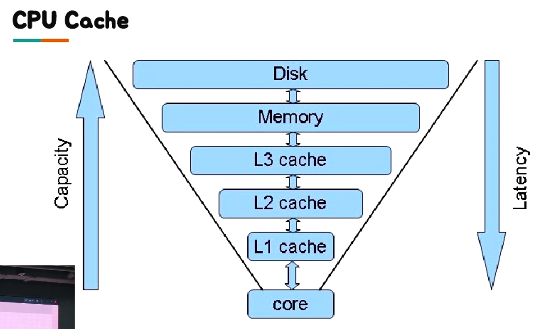
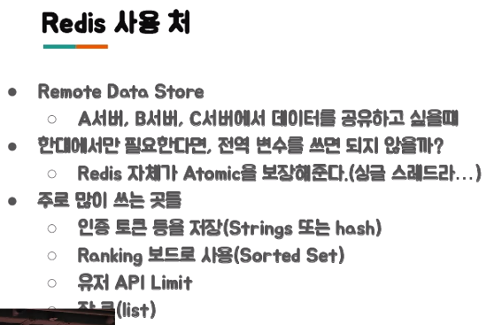

# 우아한 Redis

https://www.youtube.com/watch?v=mPB2CZiAkKM

## 1. Redis 소개

1. Redis 소개

   - In-Memory Data Structure Store

   - Open Source(BSD 3 License)
     - Support data structures
       - Strings, set, sorted-set, hashes, list
       - Hyperloglog, bitmap, geospatial index
       - Stream

   - Only 1 Committer

2. Cache

   - Cache는 나중에 요청올 결과를 **미리 저장해두었다가 빠르게 서비스** 해주는 것을 의미

   - CPU Cache : Redis는 Memory에 위치

     

3. Cache 구조

   - Memory Cache를 이용하면 더 빠른 속도로 서비스 가능  
   - Look aside Cache 방식
     - 클라이언트 요청 → **서버에서 데이터가 존재하는지 Cache를 연계 확인** → Cache에 데이터가 있으면 Cache에서 가져온다 or Cache에 없으면 DB에서 알아온다 → DB에서 가져온 데이터를 Cache에 다시 저장한다.
   - Write Back 방식
     - 클라이언트 요청 → 서버는 모든 데이터를 Cache에만 저장 → Cache에는 특정 시간동안의 데이터가 저장된다 → Cache에 있는 데이터를 DB에 저장한다 → DB에 저장된 데이터를 삭제한다.
     - 장점) DB에 insert 할 때 1개씩 500번 하는 것 보다, 500개를 1번 하는 것이 훨씬 빠르다.
     - 단점) 꺼지면 Cache에 있는 데이터가 날라간다. 즉, 장애가 생겼을 때 DB에 저장되기 전 데이터가 날라갈 수 있다.

<br/>

## 2. 왜 Collection이 중요한가?

1. Memcached는 collection 지원 X, Redis는 Collection 지원 O

   - Collection => 개발의 편의성, 개발의 난이도
   - C와 Python을 비교하자. Python에서는 map같은 라이브러리 지원이 잘 되지만 C는 직접 만들어야한다. 여기서 Memcached는 C에 대응하고, Redis는 Python에 대응한다. Redis는 만들어진 것을 갖다 쓸 수 있다.

2. 개발의 편의성 - 랭킹 서버를 직접 구현한다면?

   - 가장 간단한 방법 : DB에 유저의 Score를 저장하고, order by로 정렬 후 읽어오기
     - 문제 : 개수가 많아지면 속도에 문제가 발생 (결국 디스크 사용하므로)
     - 따라서, In-Memory 기준으로 랭킹 서버의 구현이 필요함
   - Redis의 Sorted Set을 이용하면 쉽게 구현 가능함 (+Replication도 가능)
     - 단점은 가져다 쓰면 거기 한계에 종속적이 됨
     - 랭킹에 저장해야할 id가 1개당 100byte라고 할 때, 10명 1K, 10000명 1M, 10000000명 1G 

3. 개발의 난이도 - 친구 리스트 관리

   - 친구 리스트 Key/Value 형태로 저장해야 한다면? => acid & Race Condition 문제 발생 가능

   

   

   - Redis의 경우 자료구조가 Atomic 하기 때문에 해당 Race Condition을 피할 수 있다.

4. 왜 Collection이 중요한가?

   - 외부의 Collection을 잘 이용하는 것으로, 여러가지 개발 시간을 단축시키고 문제를 줄여줄 수 있기 때문에 Collection이 중요하다

5. Redis 사용처

   

<br/>

## 3. Redis Collections

1. Redis Collecitons

   - **String** : key - value 구조

   - List : List 형태. 앞이나 뒤에 데이터 넣을 땐 빠른데 중간에 넣을 땐 느리다

   - Set : Set 형태. 중복된 데이터 방지하려고

   - **Sorted Set** : 순서가 있는 Set. ranking을 구현할 때 사용

   - Hash

2. String - 단일 Key

   - 기본 사용법
     - `Set <key> <value>` : 하나 저장
     - `Get <Key>` : 하나 값 가져오기
   - prefix를 붙인다. 왜냐면 토큰인지 뭔지 구분하기 위해서.
     - Set token:1234567 abcdefghi
     - Get token:1234567

3. Strings - 멀티 Key

   - 기본 사용법
     - `mset <key1> <value1> <key2> <value2>` : 여러 개 저장
     - `mget <key1> <key2>` : 여러 개 값 가져오기
   - 단일 key와 동일하게 prefix를 붙인다.

4. List

   - 기본 사용법 (insert)
     - `Lpush <key> <A>` => key: (A)
     - `Rpush <key> <B>` => Key: (A, B)
     - `Lpush <Key> <C>` => Key: (C, A, B)
     - `Rpush <key> <D, A>` => Key: (C, A, B, D, A)
   - 기본 사용법 (pop)
     - Key: (C, A, B, D, A)
     - `LPOP <key>` => Key: (A, B, D, A)
     - `RPOP <key>` => Key: (A, B, D)
     - `RPOP <key>` => Key: (A, B)
     - Key:()
     - `LPOP <key>` => No data
     - `BLPOP <key>` => 누가 데이터를 Push 하기 전까지 대기

5. Set : 데이터가 있는지 없는지만 체크하는 용도

   - 기본 사용법
     - `SADD <key> <Value>` : Value가 이미 Ket에 있으면 추가 X
     - `SMEMBERS <key>` : 모든 Value를 돌려 줌
     - `SISMEMBER <key> <value>` : Value가 존재하면 1, 없으면 0
   - 특정 유저를 Follow 하는 목록을 저장할 때

6. Sorted Sets : 랭킹에 따라서 순서가 바뀌길 바란다면

   - 기본 사용법
     - `ZADD <key> <Score> <Value>` 
       - Value가 이미 Key에 있으면 해당 Score로 변경
       - Score값을 기준으로 정렬
     - `ZRANGE <key> <StartIndex> <EndIndex>`
       - 해당 Index 범위 값을 모두 돌려 줌
       - Zrange testkey 0 -1 : 모든 범위를 가져 옴
   - Sorted Sets의 score는 **double 타입(실수형)이기 때문에 값이 정확하지 않을 수 있다**. JS와 같이, 아주 큰 수의 경우 제대로 표현되지 않는 경우가 있다. 어떤 정수는 실수에서 표현이 되지 않는다. JS에서도 큰 id 수를 보내야할 때는 정수형이 아니라 string형태로 보내야한다. 

   ```
   - 정렬이 필요한 값
   
   select * from rank order by score limit 50, 20;
   => zrange rank 50 70
   
   select * from rank order by score desc limit 50, 20;
   => zrevrange rank 50 70
   
   
   - Score 기준으로 뽑고 싶을 때
   select * from rank where score >= 70 and score < 100;
   => zrangebyscore rank 70 100
   select * from rank where score > 70;
   => zrangebyscore rank (70 +inf
   ```

7. Hash : Key 밑에 Sub key가 존재

   - 기본 사용법
     - `Hmset <key> <subkey1> <value1> <subkey2> <value2>`
     - `Hgetall <key>` : 해당 key 의 모든 subkey와 value를 가져옴
     - `Hget <key> <subkey>`
     - `Hmget <key> <subkey1> <subkey2> ... <subkeyN>`

8. Collection 주의 사항

   - 하나의 컬렉션에 너무 많은 아이템을 담으면 좋지 않음
     - 10000개 이하 몇 천개 수준으로 유지하는 것이 좋다
   - Expire는 Collection의 item 개별로 걸리지 않고 전체 Collection에 대해서만 걸림
     - 해당 10000개의 아이템을 가진 Collection에 expire가 걸려있다면, 그 시간 후에 10000개의 아이템이 모두 삭제된다.

<br/>

## 4. Redis 운영

1. 메모리 관리를 잘 하자
   - 메모리 관리
     - Redis는 In-Memory Data Store
     - Physical Memory 이상을 사용하면 문제가 발생한다. 그 때, **Swap이 있다면** Swap 사용하며 한 번 Swap이 일어난 page는 그 이후로 계속 swap이 발생한다. 디스크에 접근해야하기 때문에 성능이 떨어진다. Swap이 없으면?
     - Maxmemory를 설정하더라도 이보다 더 사용할 가능성이 크다. (Maxmemory : 이 이상 메모리를 사용하지 않도록 함. 만약 사용해야하면 레디스가 데이터를 임의로 지우고 메모리를 확보) => data allocate를 위해 기존에 잘 짜여진 jmalloc을 사용하는데, 이것도 완벽하지 않다.
     - RSS 값을 모니터링 해야함
2. O(N) 관련 명령어는 주의하자
3. Replication
4. 권장 설정 Tip

<br/>

## 5. Redis 데이터 분산

1. Redis Cluster


<br/>

## 6. Redis Failover


## 7. 다루지 않는 것들

- Redis Persistence (RDB, AOF)
- Redis Pub/Sub
- Redis Stream
- 확률적 자료구조 Hyperloglog
- Redis Module

