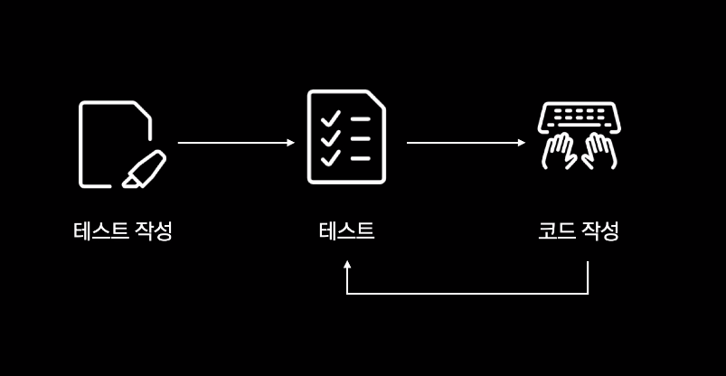
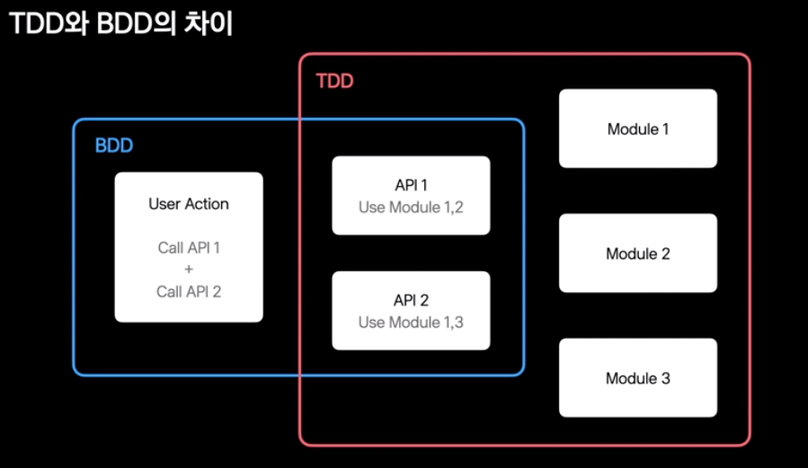
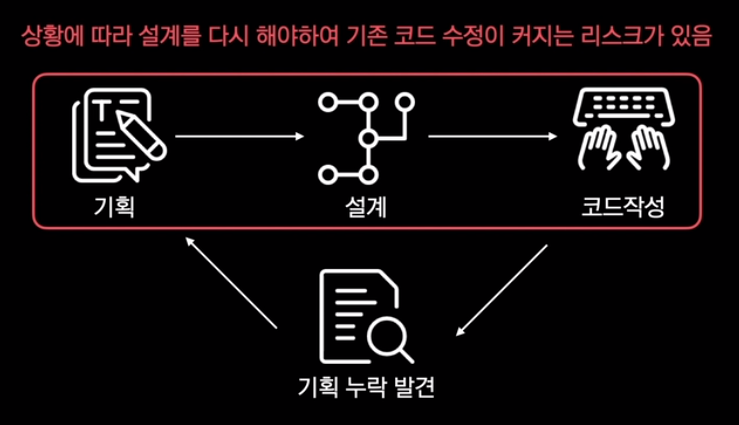
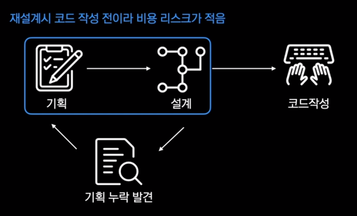
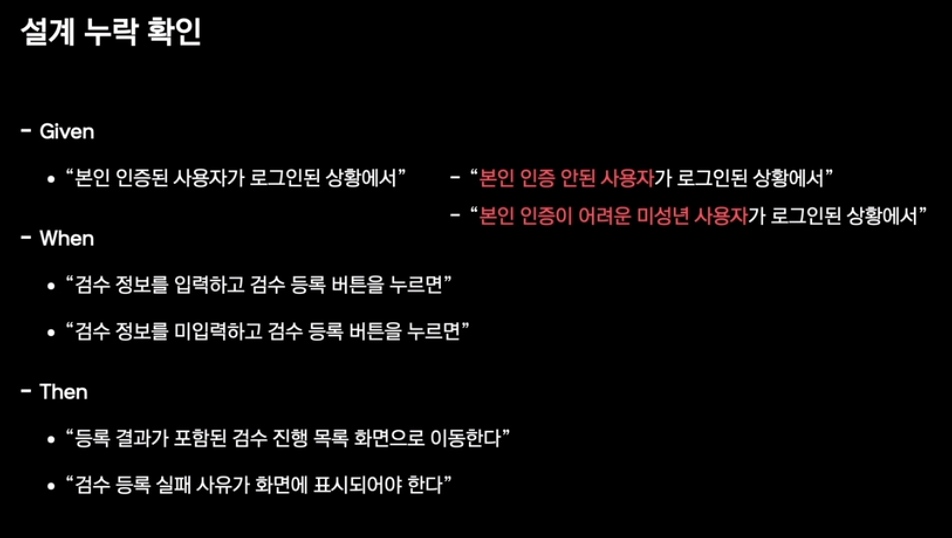
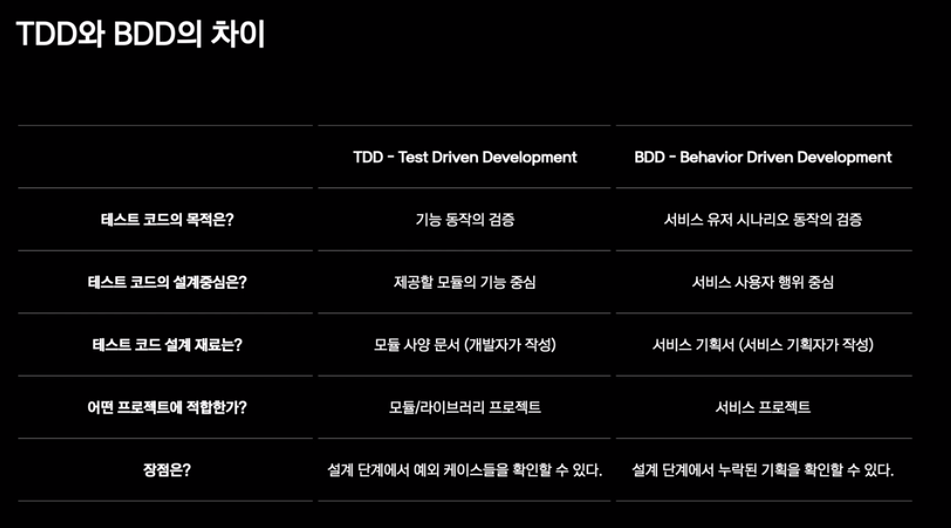
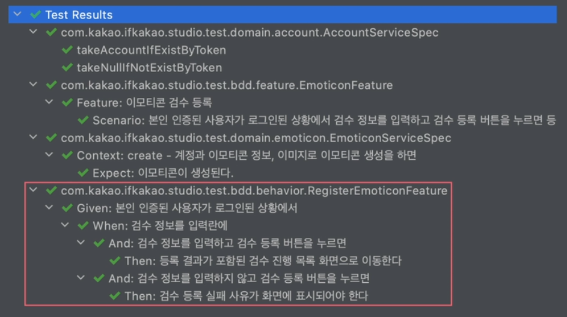
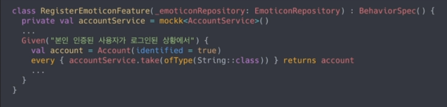
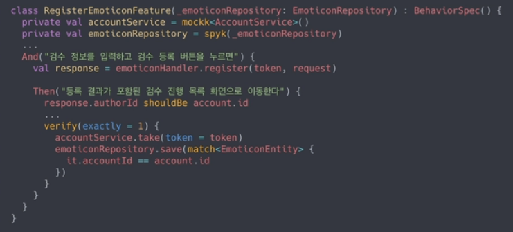
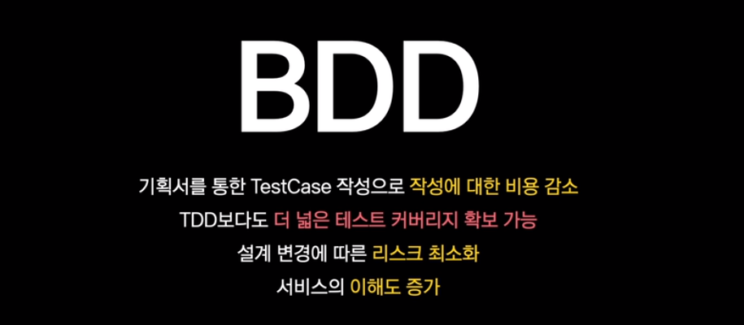

# kotest가 있다면 TDD 묻고 BDD로 가!

https://tv.kakao.com/channel/3693125/cliplink/414004682

## 1. TDD/BDD 란?

### 1. TDD

1. TDD (Test Driven Development) : 개발이 테스트 주도로 진행됨

   

   - 테스트 케이스 작성하는 것 자체가 TDD는 아니다.
   - **테스트 케이스를 우선적으로 작성**하고 다음으로 코드를 작성함.

2. Testable : **테스트가 가능한** 설계로 짜여진 코드 작성이 된다.

   - Testable code의 장점
     - 모듈의 크기를 줄이는 설계를 유도
     - 모듈, 계층간의 커플링을 적게 만들어 유지보수, 확장이 가능

3. 왜 TDD를 안 할까?

   - 일정관리, 리소스 관리 측면에서 부담이 커서 잘 안 함
   - Testcase 창작의 고통, 일정 지연 압박, Test 포기한 개발/배포
   - 기술 부채가 늘어나는 악순환이 된다.

 

### 2. BDD

1. BDD란?
   - 요구사항, 기획서가 Testcase가 되도록 하는 것이 BDD
   - TDD에서 파생된 개발 방법론
   - 개발자와 비개발자간의 협업 과정을 녹여낸 방법
   - 사용자의 행위를 작성하고 결과 검증을 진행
   - BDD로 테스트 코드를 작성함에 따라 설계 역시 행위의 중심이 되는 도메인 기반 설계가 됨
2. 정형화된 형식
   - Given : 주어진 환경
   - When : 행위
   - Then : 기대 결과
3. 예시) 이모티콘 스튜디오 검수 등록 화면 기획서
   - 검수 등록 필수 조건 : 서비스 가입 여부, 로그인 여부, 본인 인증 여부
   - 검수 등록 입력 사항 : 이모티콘 정보, 이모티콘 이미지
   - 등록시
     - 정상 등록된 경우 : 검수 진행 목록으로 이동하여 등록된 내용이 표시되어야 함
     - 등록 실패된 경우 : 등록 실패 사유가 표시되어야 함
4. BDD Test Case
   - Given
     - "본인 인증된 사용자가 로그인된 상황에서"
   - When
     - "검수 정보를 입력하고 검수 등록 버튼을 누르면"
     - "검수 정보를 미입력하고 검수 등록 버튼을 누르면"
   - Then
     - "등록 결과가 포함된 검수 진행 목록 화면으로 이동한다"
     - "검수 등록 실패 사유가 화면에 표시되어야 한다"

 

## 2. TDD와 BDD의 차이

1. Test case 목적의 관점에서 차이가 있다.

   - TDD : "기능"을 확인하는 관점
     - add(1, 1)이 2인지 확인
   - BDD : 시나리오 주체를 기준으로한 "행위"를 확인하는 관점
     - 사용자가 "="를 눌렀을 때 1+1의 값 2가 화면에 표시되는지 확인

   

2. BDD의 TC로는 완벽하지 않다. BDD로 시나리오를 확인하고, TDD의 TC로 테스트를 해야한다. 둘 중 하나를 선택하는 것이 아니다. 상호보완적인 관계다.

3. TDD : 상황에 따라 설계를 다시 해야하여 기존 코드 수정이 커지는 리스크 있음

   

4. BDD : 재설계시 코드 작성 전이라 비용 리스크가 적음

   

5. 설계 누락 확인

   

6. TDD와 BDD의 차이

   

 

## 3. kotest를 쓰자

1. 코틀린에서 지원되는 테스트 프레임워크, TC를 다양한 스타일로 만들 수 있게 도와준다. BDD, TDD 포함

   - BDD : BehaviorSpec, FeatureSpec
   - TDD : AnnotationSpec, ExpectSpec

2. BehaviorSpec : Given / When / Then 구조를 지원하는 BDD용 스타일

   - And : 하위 분기

   

   

3. FeatureSpec : Fefature / Scenario 구조를 지원하는 BDD용 스타일

   - Given / When / Then 구조까지 내려갈 필요없고 TC를 작성해야 할 때
   - 시나리오의 행위자를 특정하기 어렵거나 특정 기능에 대해서만 쓰여진 기획

   

4. AnnotationSpec : JUnit 형태의 Testcase 작성을 하게 해주는 TDD용 스타일

   

5. ExpectSpec : DSL로 Testcase 작성을 하게 해주는 TDD용 스타일

   - context : expect를 그룹핑하게 해준다.

   

 

## 4. mockk를 쓰자

1. mockk : mocking library for kotlin

2. mocking

   - mock을 생성하여 어떠한 행위를 할 것인지에 대하여 사전 정의
   - 외부 서비스의 사용 등

   

3. verify

   - 해당하는 행위가 원하는대로 시행이 되었는지 검증

   

 

## 5. Tests Succeed

