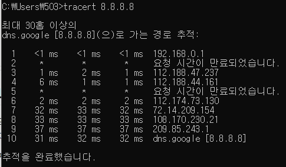
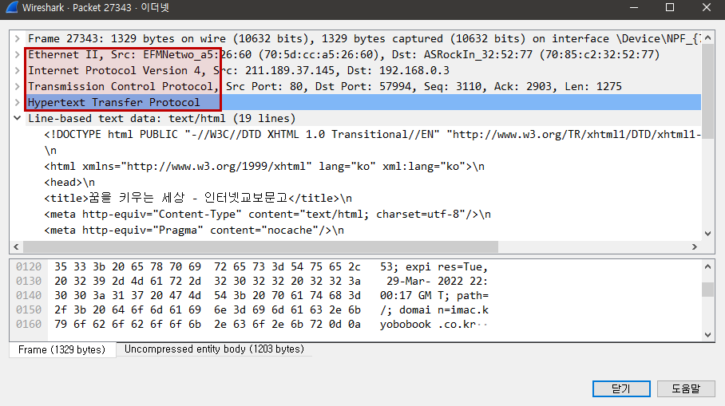

# 01. 네트워크란 무엇인가?

## 1. 네트워크란 무엇인가?

1. 네트워크 : **노드**들이 데이터를 공유할 수 있게하는 디지털 **전기 통신망**
2. 인터넷 : 문서, 그림 영상과 같은 여러가지 데이터를 공유하도록 구성된 세상에서 **가장 큰 네트워크**
   - 네트워크 안에 인터넷이 포함된 것. 가장 큰 네트워크가 인터넷
   - www != 인터넷. www는 인터넷을 통해 **웹과 관련된 데이터**를 공유하는 것

 

## 2. 네트워크의 분류

1. 크기에 따른 분류
   - LAN (Local Area Network) : **가까운 지역**을 하나로 묶은 네트워크
   - WAN (Wide Area Network) : 멀리 있는 지역을 하나로 묶은 네트워크. **LAN과 LAN을 다시 묶은 것**
   - 기타 : MAN, VLAN, CAN,, PAN 등
2. 연결 형태에 따른 분류
   - Star 형 : **중앙 장비에** 모든 노드가 연결. 주로 LAN 대역 장비들을 연결시킬 때 사용
   - Mesh 형 : 여러 노드들이 **그물처럼** 다양하게 연결. 주로 WAN 대역 연결. 장비와 장비를 거쳐서 연결 가능
   - Tree 형 : 나무의 가지처럼 계층 구조로 연결
   - 기타 : 링형, 버스형, 혼합형(현실과 비슷) 등

 

## 3. 네트워크의 통신 방식

1. 네트워크에서 데이터는 어떻게 주고 받는가?
   - 유니 캐스트 : 특정 대상과 **1:1**로 통신
   - 멀티 캐스트 : 특정 다수와 **1:N**으로 통신
   - 브로드 캐스트 : **네트워크에 있는 모든 대상**과 통신

 

## 4. 네트워크 프로토콜

1. 프로토콜 : **네트워크에서 데이터 통신을 위한 약속**. 어떤 노드가 어느 노드에게 어떤 데이터를 어떻게 보내는지 작성하기 위한 양식
2. 여러가지 프로토콜
   - **가까운 곳**과 연락할 때 : Ethernet 프로토콜 (**MAC 주소**)
   - **멀리있는 곳**과 연락할 때 : ICMP, IPv4, ARP (**IP 주소**)
   - **여러 프로그램**으로 연락할 때 : TCP, UDP (**포트 번호**)
3. 패킷 : 여러 프로토콜들로 캡슐화된 것

 

## 5. 실습

1. 구글과 나는 어떻게 연결되어 있는지 확인해보기

   - 별 표시는 IP 주소를 공개해두지 않은 곳
   - 현재 위치에서 구글까지 가는 데 거치는 네트워크 대역을 표시 

   

2. Wireshark 설치 & 프로토콜 직접 확인해보기

   - Ethernet, IPv4, TCP, HTTP 등 확인 가능

   
