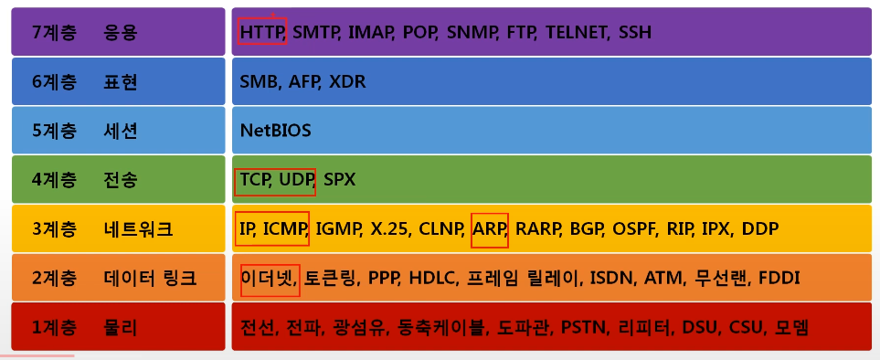
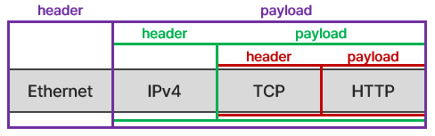
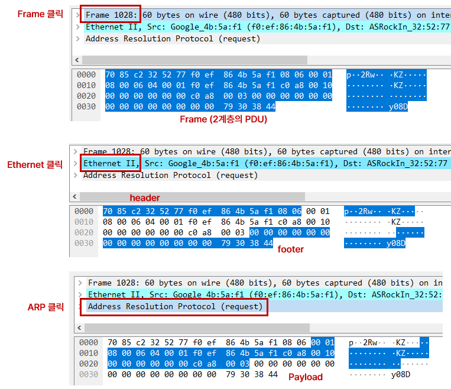
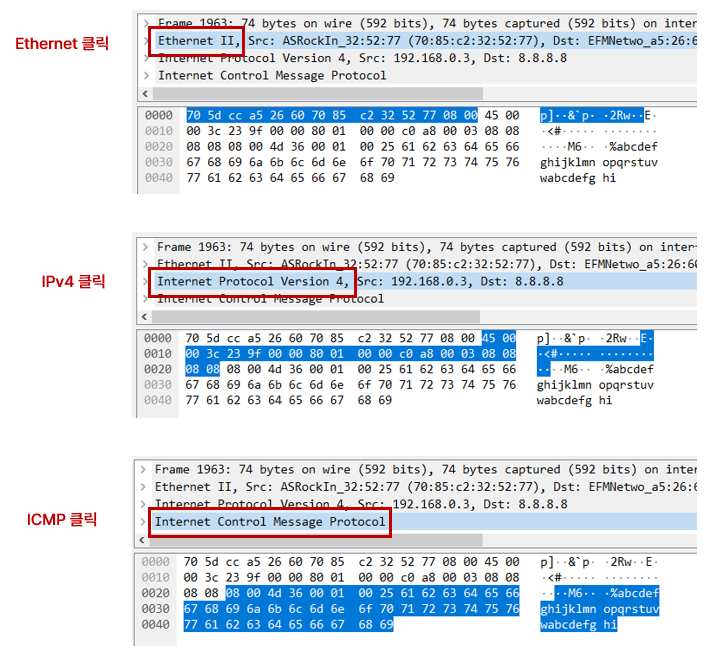

# 02. 네트워크의 기준! 네트워크 모델

## 1. 네트워크 모델의 종류

1. TCP / IP 모델

   - 현재의 인터넷에서 컴퓨터들이 서로 정보를 주고받는데 쓰이는 통신 규약의 모음
   - 네트워크 인터페이스 - 네트워크 - 전송 - 응용

2. OSI 7계층 모델

   - 데이터를 주고받을 때 **데이터 자체의 흐름을 구간별로** 나눠 놓은 것
   - 물리 - 데이터 링크 - 네트워크 - 전송 - 세션 - 표현 - 응용

   

 

## 2. 두 모델 비교

1. 공통점
   - 계층적 네트워크 모델, 계층간 역할 정의
2. 차이점
   - 계층의 수
   - OSI는 **역할** 기반, TCP/IP는 **프로토콜** 기반
   - OSI는 통신 전반에 대한 표준, TCP/IP는 전송 기술 특화

 

## 3. 네트워크를 통해 전달되는 데이터, 패킷

1. 패킷 : 네트워크 상에서 전달되는 데이터를 통칭하는 말. 데이터의 형식화된 블록

   - 헤더, 페이로드, 풋터(잘 사용X)로 구성

   

2. 패킷을 이용한 통신과정

   - 캡슐화(encapsulation) : 여러 프로토콜을 이용해서 최종적으로 **보낼 때 패킷**을 만드는 과정
   - 디캡슐화(decapsulation) : **패킷을 받았을 때** 프로토콜들을 하나씩 확인하면서 데이터를 확인하는 과정

3. 계층별 패킷의 이름 PDU (Protocol Data Unit)

   - 4계층의 PDU : 세그먼트
   - 3계층의 PDU : 패킷
   - 2계층의 PDU : 프레임

 

## 4. 실습

1. wireshark로 3계층 ARP 프로토콜 확인

   

2. wireshark로 3계층 ICMP 프로토콜 확인

   

