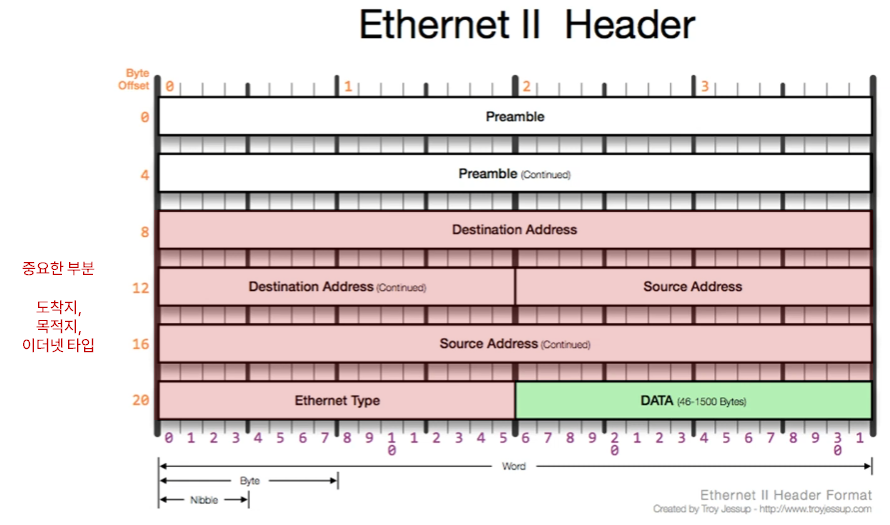
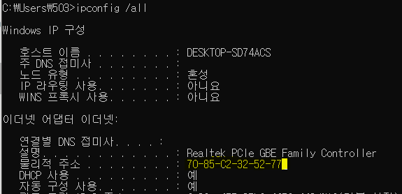
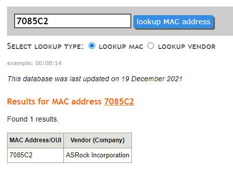
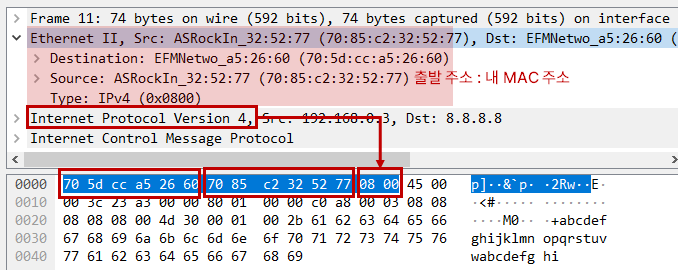

# 03. 가까이 있는 컴퓨터끼리는 이렇게 데이터를 주고 받는다.

## 1. 2계층에서 하는 일

1. 2계층의 기능
   - **같은 LAN 대역**에 존재하는 여러 장비들 중에서 A장비가 B장비에게 데이터를 보낼 때 
   - **오류제어, 흐름제어** 수행
2. 2계층의 네트워크 크기
   - 같은 네트워크 대역, LAN에서만 통신할 때 사용. **다른 네트워크와 통신할 때는 3계층이 필요**

 

## 2. 2계층에서 사용하는 주소

1. MAC 주소 : 물리적인 주소. LAN에서 통신할 때 사용
   - 12자리의 16진수로 사용 (OUI, 제조회사 식별 ID 6자리 + 고유번호, 제조사가 부여한 번호 6자리)
   - 16진수 2개당 1 byte이므로, 총 6 byte

 

## 3. 2계층 프로토콜

1. Ethernet 프로토콜 : LAN에서 통신할 때 사용

   - 목적지 주소, 출발지 주소 : **MAC 주소** , 각각 6byte
   - Ethernet Type : **3계층(상위) 프로토콜이 무엇인지** , 2byte
     - 0800 : IPv4 , 0806 : ARP
   - DATA : payload 부분

   

 

## 4. 실습

1. MAC 주소 확인

   - [MAC Address and OUI lookup](https://aruljohn.com/mac/7085C2) : OUI로 제조회사 알아낼 수 있다

   

   

2. wireshark로 Ethernet 확인

   
