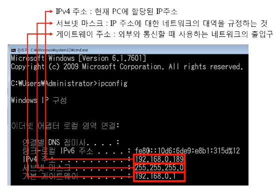
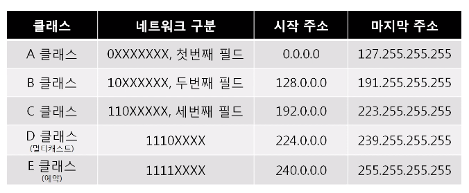
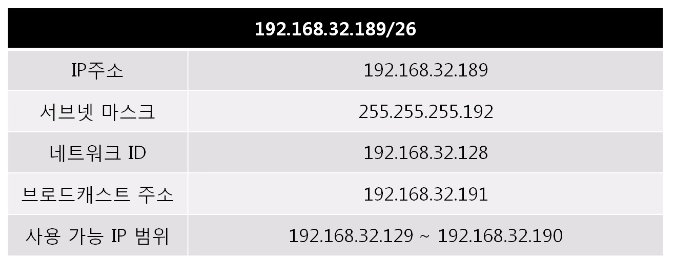
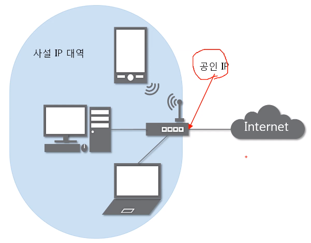
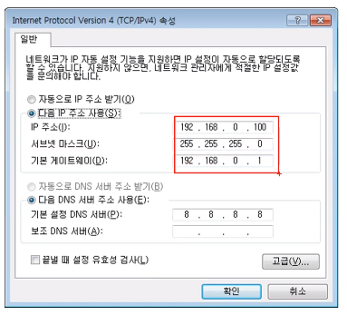

# 04. 실제로 컴퓨터끼리는 IP주소를 사용해서 데이터를 주고받는다.

## 1. 3계층의 기능

1. 3계층에서 하는 일

   - 서로 다른 네트워크 대역(LAN과 LAN)을 연결시켜주는 역할

2. 3계층에서 쓰는 주소

   - IP 주소 : WAN에서 통신할 때 사용하는 주소

   

3. 3계층 프로토콜

   - ARP 프로토콜 : IP 주소를 이용해 MAC 주소를 알아낸다.
   - IPv4 프로토콜 : WAN에서 통신할 때 사용한다.
   - ICMP 프로토콜 : 서로가 통신되는지 확인할 때 사용한다.

 

## 2. 일반적인 IP 주소

1. Classful IP 주소

   - 클래스 별로 구분. 낭비가 심하다. => 부족해진다.

   

2. Classless IP 주소

   - 낭비되지 않도록 아껴쓰기 위해 **서브넷 마스크**와 함께 사용해서 구분한다.
   - 서브넷 마스크
     - Classful한 네트워크 대역을 나눠주는데 사용하는 값
     - 어디까지가 네트워크 대역이고, 어디서부터 호스트인지 구분
     - 2진수로 표기했을 때 1로 시작, 1과 1사이에는 0이 올 수 없다. (연속된 1과 0) => 1과 0의 경계가 네트워크, 호스트의 경계. 1인 부분들까지가 네트워크, 0인 부분들이 호스트.
   - 서브넷팅 : 서브넷 마스크를 이용해서 네트워크 대역을 나누는 것.
   
   
   
3. 사설 IP와 공인 IP

   - 공인 IP : 실제 네트워크 통신망과 통신할 때 사용하는 IP
   - 사설 IP : 같은 네트워크 대역에서 사용하는 IP. 공인 IP 1개당 2^32개(0.0.0.0 ~ 255.255.255.255)의 사설 IP
   - 같은 네트워크 대역에 여러 대의 기기가 물려있을 때, 각각의 기기는 사설 IP를 사용한다. 네이버 같은 다른 네트워크 대역으로 요청을 보낼 때는 공유기를 통해서 공인 IP로 변경돼서 나간다. 그래서 외부에서 볼 때 공인 IP로만 보이기 때문에 어떤 사설IP에서 요청보냈는지 알 수는 없다. 전달받을 때는 공유기가 사설 IP로 찾아다가 준다. 이런 식으로 네트워크 주소를 **특정 IP(주로 사설 IP)에서 특정 IP(주로 공인 IP)로 바꿔주는 걸 NAT**라고 한다.
   - 공유기는 사설 IP에서 공인 IP로 바뀌어서 요청이 나갈 때 NAT table에 어떤 사설 IP인지 작성해서 내보낸다. 요청이 나간 적 없는데 외부로부터 무언가 들어온다면 공유기 선에서 버린다. 그래서 **서버같은 경우 사설 IP를 사용하지 않고 공인 IP를 사용**한다. (우리 집에서 네이버에 요청을 보내면, 네이버는 요청을 받은거지 한 적이 없는거니까, 사설 IP에 네이버가 있으면 네이버의 공유기가 요청을 받아서 네이버의 사설 IP로 전해주지 않는다.) => 따로 설정(**포트 포워딩**/4계층)을 통해 가능하게 할 수는 있다.
   - 실제로, 사실 IP와 공인 IP에 Classlee IP를 함께 사용한다.

   

 

## 3. 특수한 IP 주소

1. 0.0.0.0 : widcard. 나머지 모든 IP

2. 127.0.0.1 : 나 자신을 나타내는 주소

3. 게이트웨이 주소 : 어딘가로 가려면 일단 여기로 이동. 일반적으로 공유기의 IP

   - 일반적으로 사용할 수 있는 IP들 중 가장 낮거나 가장 높은 IP를 사용한다.
   - 외부로 인터넷 요청을 보낼 때 이용하는 문. 게이트웨이가 설정 안 되면 인터넷 이용 X

   

 

## 4. 실습

1. 내 PC의 IP 주소 확인하기
   - cmd창에서 `ipconfig` 입력하기 (사설 IP 출력됨)
2. 네이버 서버가 알고있는 나의 IP 주소 확인하기
   - 네이버 검색창에 `내 IP` 검색하기 (공인 IP출력됨)

