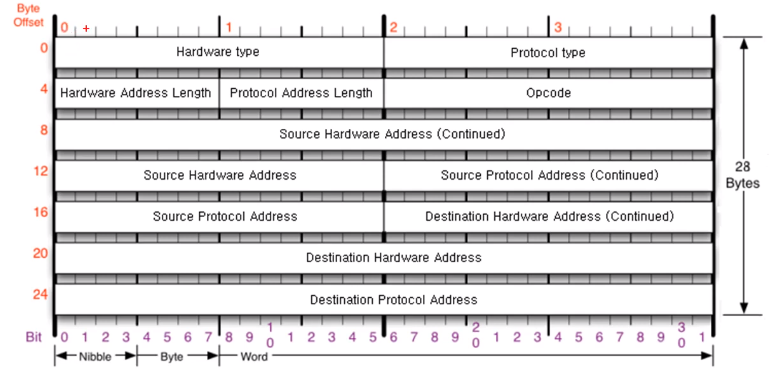
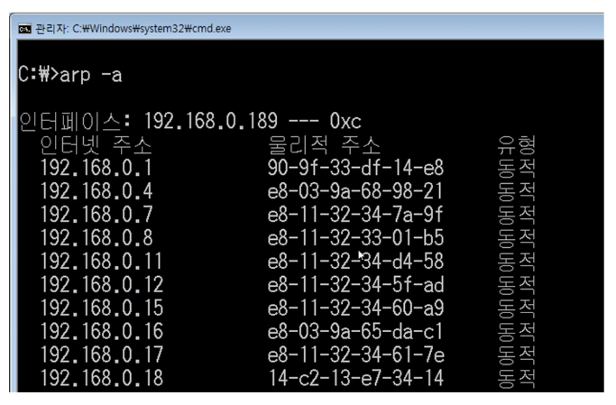
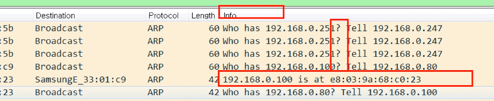
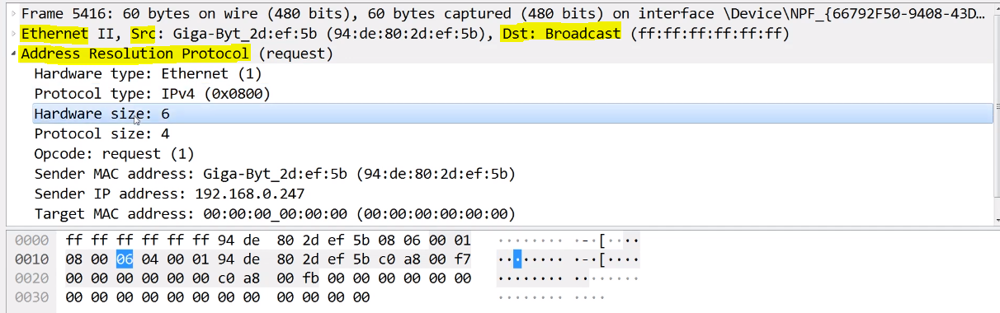
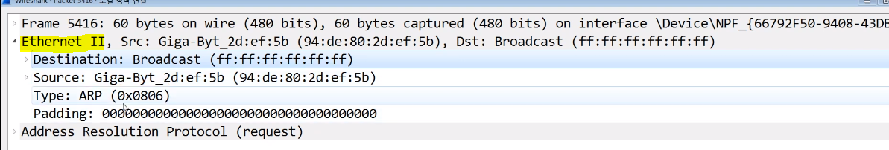
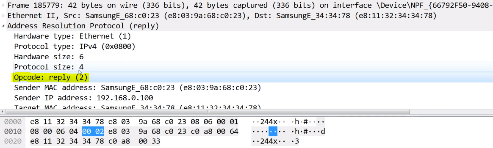

# 05. 통신하기 전 반드시 필요한 ARP 프로토콜

## 1. ARP 프로토콜

1. ARP 프로토콜

   - **같은 네트워크 대역**에서 통신하기 위해 **필요한 MAC 주소를 IP 주소를 이용해서 알아오는** 프로토콜
   - 3계층이지만 같은 네트워크 대역에서만 쓰인다.
     - MAC 주소를 모르니까 이더넷 쪽에서 브로드캐스트로 온다.
     - 그런데 3계층 장비는 브로드캐스트를 밖으로 내보내지 않고, 같은 네트워크 대역에서만 놀게한다.
   - 구조
     - Hardware type : 2계층에서 사용하는 Protocol의 type. 거의 이더넷 (0001) 
     - Protocol type : Protocol Address의 type.  거의 IPv4 (0800)
     - Hardware Address Length : MAC 주소를 사용하니까 6byte (06)
     - Protocol Address Length : IPv4 주소를 사용하니까 4byte (04)
     - Opcode : **어떻게 동작하는지** 나타내는 코드. IP 주소로 MAC주소를 알아내는 것이기 때문에, MAC주소를 물어보는 건지, 물음에 대한 응답을 해주는건지 두 가지 경우가 있다. **물어볼 때는 0001, 응답을 해줄 때는 0002**를 사용한다. 
     - Source Hardware Address : 6byte. 출발지의 MAC 주소 
     - Source Protocol Address : 4byte. 출발지의 IPv4
     - Destination Hardware Address : 6byte. 목적지의 MAC 주소
     - Destination Protocol Address : 4byte. 목적지의 IPv4

   

 

## 2. ARP 프로토콜의 통신 과정

1. A가 C한테 MAC주소를 알아보기 위해 ARP 요청을 보낸다. (앞에 이더넷 프로토콜 붙여서)
   - 요청이니까 opcode는 0001
   - 이더넷, ARP 프로토콜의 도착지 MAC 주소는 모르기 때문에 **ARP는 0**으로, **이더넷은 F**로 채워서 보낸다. IP주소는 아니까 IP만 넣어서 보낸다.
   - 이더넷을 F (2진수로 바꾸면 1111) 로 채우는 이유는, 이 주소가 **브로드캐스트 주소**이기 때문
   - MAC주소를 모르니까 **같은 네트워크 대역에 물린 기기에 모두 요청**을 보낸다.
2. 같은 네트워크 대역에 물린 모든 기기가 요청을 받으면 **디캡슐레이션**한다. 
   - 이더넷을 확인했을 때 브로드캐스트니까 OK
   - ARP를 확인했을 때 **본인의 IP주소와 비교**해서 불일치하면 패킷을 버린다.
3. C는 ARP에서 본인의 IP 주소와 일치했으니 ARP 응답을 보낸다.
   - 응답이니까 opcode는 0002
   - 출발지 MAC 주소에 자신의 MAC 주소를 쓰고, 목적지는 A의 주소를 쓴다.
   - 이 경우, 목적지의 주소를 모두 알기 때문에 **이더넷에 브로드캐스트 할 필요없다.** 
4. A가 패킷을 받으면, 이제 C의 MAC 주소를 알게된다.
   - 해당 내용은 **ARP 캐시 테이블에 저장**한다.
   - 그 후 하고싶은 통신을 할 수 있다.

 

## 3. ARP 테이블

1. ARP 테이블 : 통신했던 컴퓨터들의 주소를 저장한다.

   - 캐시 테이블이니, 일정 시간 후 사라진다.
   - arp spoofing (공격) 할 때 중요하다.

   

 

## 4. 실습

1. ARP 테이블 확인하기

   - cmd 창에 `arp -a` 를 입력한다.

2. ARP 프로토콜 분석하기

   - 필터에 ARP 입력하기
   - info탭에 `?`가 있으면 요청, 없으면 응답

   

   - 요청

     - ARP

       - 192.168.0.247 사용자가 Broadcast 한 것.
       - 나에게 오려고 한 것이 아닐 수 있다. Broadcast라 일단 온 것
       - 목적지 Target MAC Address는 모르니까 0으로 채워져 있다.

       

     - Ethernet

       - type는 상위 프로토콜 ARP
       - padding은 **frame의 최소 크기(60byte, 최대는 1514byte)를 맞춰주기 위해 추가**해주는 것. ARP는 28byte, Ethernet은 14byte로 합 42byte라 18byte가 부족해서 채워준다. 간혹 padding이 안 붙어있는 경우도 있는데, wireshark에서 캡쳐를 일찍해서 그렇게 보이는 것, 실제로는 붙는다. 

       

   - 응답

     - ARP

       - opcode가 2이고, 목적지와 출발지가 잘 작성됨

       
