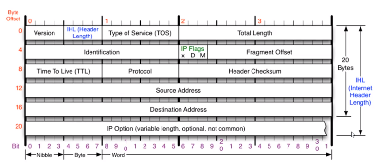
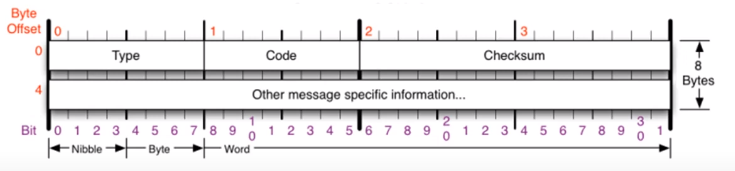
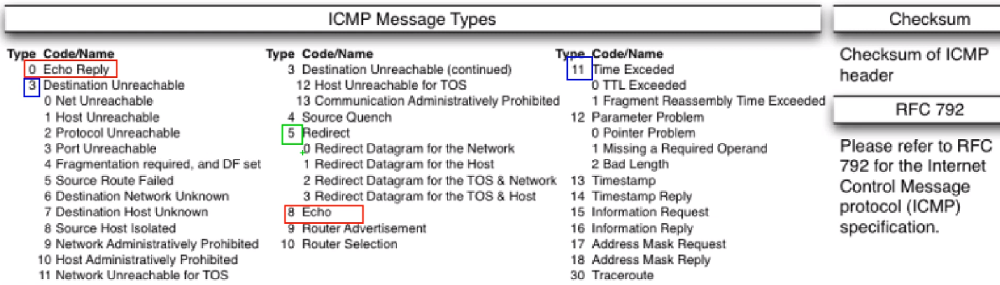
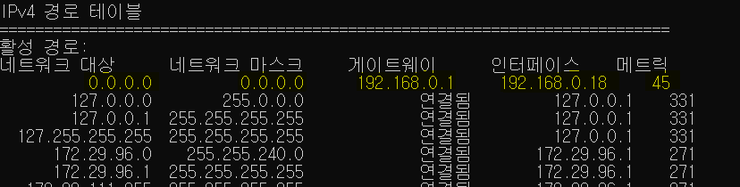
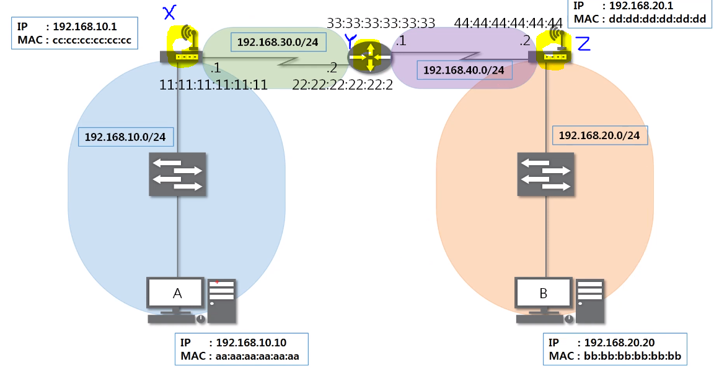
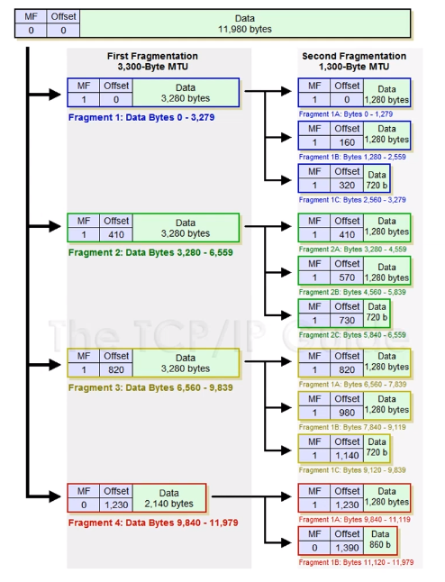
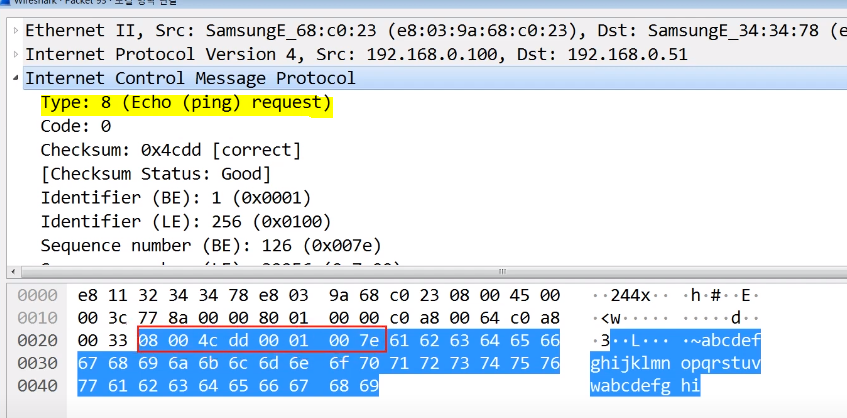
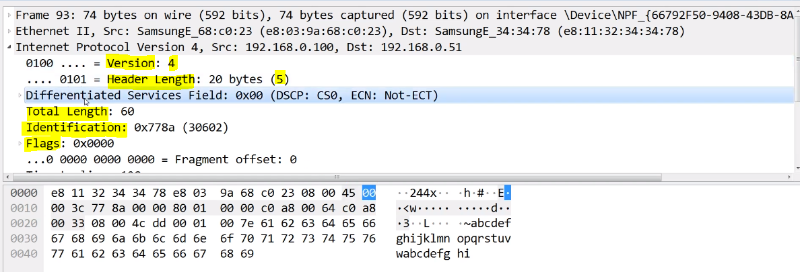
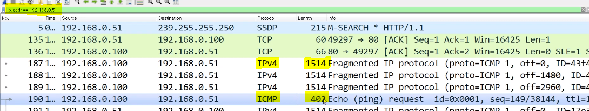

# 06. 멀리 있는 컴퓨터끼리는 이렇게 데이터를 주고받는다.

## 1. IPv4 프로토콜

1. IPv4가 하는 일

   - 네트워크 상에서 데이터를 교환하기 위한 프로토콜
   - 데이터가 **정확하게 전달되는 것을 보장하지 않는다** (이건 TCP에서 함)

2. IPv4 프로토콜의 구조

   - **20byte** + option 4byte 단위. 최대 10개 붙을 수 있어서 60byte까지 가능

   - 구조

     - Version : IP의 버전. IPv4, IPv6가 있는데, IPv6는 구조가 달라서 **그냥 무조건 4**
     - IHL (Header Length) : **IP header의 길이**. 원래 20 + a(byte)이 들어가야하는데, 1byte = 4bit = 최대 15 (1111) 이라서, **값을 4로 나눈 값 (5 + a) 을 넣는다.** 보통 option이 잘 안 붙어서 주로 5가 들어간다.
     - Type of Servie (TOS) : 옛날에 쓰던거고, 지금은 안 써서 0으로 비워둔다.
     - Total Length : header 뿐만 아니라 뒤의 **payload까지 합친 길이**. 전체 길이.
     - Identification & IP Flags & Fragment Offset : 큰 데이터를 보낼 때, 최대 전송 길이가 있어서 **잘라서 보내는데, 그 때 사용되는 값**들.
       - Identification : 잘려진 데이터들끼리 짝 찾을 때 사용
       - IP Flags : 3 bit (x, D, M)로 이루어짐. x는 안 씀. D는 **dont flagmentation**으로 보내는 사람이 안 쪼개서 통으로 보내겠다는 것. 근데 이렇게 통짜로는 전송이 안 돼서 거의 안 씀, M은 **more flagmentation**으로 조각화 됐을 때, 나 말고 패킷이 더 있으니까 기다리라는 뜻
       - Fragment Offset : 잘려진 데이터 복구할 때 순서를 위함. 시작 부분으로부터 얼마나 떨어져 있는지 offset. 시작 부분으로부터의 길이를 **8로 나눈 값**을 쓴다.
     - Time To Live (TTL) : 패킷이 살아있을 수 있는 시간. 중간에 꼬여서 어느 구간에서 패킷이 빙빙 돌면, 무한히 쌓이게 되니까 일정 시간 이후 버리도록 한다. 운영체제마다 값이 다른데, 윈도우는 128, 리눅스는 64이고 장비 하나 넘어갈 때마다 1씩 줄어든다.
     - Protocol : 상위 프로토콜 타입. ICMP (01) , TCP (06) , UDP (17) 
     - Header Checksum : header 값이 맞는지 계산해서 확인
     - Source / Destination Address : 출발지, 목적지 주소
     - IP Option : 옵션. 최대 10개까지. 4byte 단위로 붙는다.

     

 

## 2. ICMP 프로토콜

1. ICMP (Internet Control Message Protocol)가 하는 일

   - 인터넷 상에서 **제어 메시지**를 주고 받는 프로토콜
   - 네트워크 컴퓨터 위에서 돌아가는 운영체제에서 **오류 메시지**를 전송 받는 데 주로 쓰인다.
   - **특정 대상과 내가 통신이 잘 되는지** 확인

2. ICMP 프로토콜의 구조

   - Type : 대분류
     - 0, 8 : 기본. 통신 확인할 때, 0번은 응답 8번은 요청
     - 3, 11 : 뭔가 잘 못 됐을 때. 3번은 목적지까지 가지 못했을 때 (주로 경로상 문제, 라우터 문제), 11번은 목적지까지 가긴 했는데 응답을 못 받았을 때 (주로 상대방 문제, 방화벽 문제)
     - 5 : 보안상 중요. 상대방의 라우팅 테이블을 ICMP 가지고 수정할 때 사용
   - Code : 소분류
   - Checksum

   

   

 

## 3. 라우팅 테이블

1. 내가 보낸 패킷은 어디로 가는가

   - 라우팅 테이블 : 어디로 보내야 하는지 설정되어 있음 (지도)
   - cmd 창에 `netstat -r`을 입력하면 나온다.
   - 0.0.0.0 이 특수한 IP인데, 지도에 없으면 0.0.0.0 으로 나가라고 기본으로 지정해주는 것

   

 

## 4. 다른 네트워크와 통신 과정

1. A가 B와 통신하고 싶을 때, 우선 A는 자신의 라우팅 테이블을 확인한다.
   - A의 라우팅 테이블에 B의 네트워크 대역이 있어야만 갈 수 있음
2. "Ethernet - IPv4 - ICMP 요청" 으로 인캡슐레이션된 패킷을 만든다.
   - ICMP에서 type 요청은 8, 응답은 0
   - Ethernet 의 목적지 주소는 X의 cc:cc:cc:cc:cc:cc (게이트웨이의 MAC주소)를 작성한다. 이더넷은 가까운 곳에서 갈 수 있는 곳으로 작성해야해서, **B가 아니라 가장 가까운 곳으로** 작성한다.
3. X가 받아서 디캡슐레이션 해서 3계층까지 확인한 후, 목적지가 자신이 아닌 것을 확인하고 B로 본기위해 자신의 라우팅 테이블을 확인한다. 
   - 라우팅 테이블에서 B 쪽으로 가려면 우선 Y로 가라고 적혀있는 것을 확인한다.
   - Ethernet 프로토콜을 다시 작성한다. 출발지 MAC주소는 11:11:11:11:11:11이고 목적지 맥주소는 Y의 22:22:22:22:22:22
4. Y, Z가 받아서 동일하게 반복하며 Ethernet 프로토콜을 다시 작성한다.
5. Z가 B로 보내주면 완료
   - B는 디캡슐레이션해서 ICMP를 확인하고, 요청을 받았으니 응답 (0) 을 해준다. 

 

## 5. IPv4와 조각화

1. 조각화란?
   - 큰 IP 패킷들이 적은 **MTU** (Maximun Transmission Unit, 일반적으로 1500byte) 를 갖는 링크를 통하여 전송되려면 **여러 개의 작은 패킷으로 쪼개어 전송**돼야 한다.
   - 일단 조각화되면, **최종 목적지에 도달할 때까지 재조립되지 않는 것이 일반적**이다.
   - IPv4 에서는 발신지 뿐만 아니라 중간 라우터에서도 조각화가 가능하고 IPv6에서는 발신지에서만 가능
   
2. 조각화하는 과정

   - MTU에서 IP 프로토콜의 길이 20byte를 제외한 값을 payload로 보낼 수 있다.
   - **MF** : more flagmentation, 조각화 했을 때 내 뒤에 패킷이 더 있는지. 조각화 4의 경우 뒤에 패킷이 더 없으니까 0이 된다.
   - **offset** : 처음 시작 위치로부터 떨어진 거리, 8로 나눈 값을 사용한다. 그래서 조각화 1의 data 길이가 3280 byte면, 조각화 2의 offset은 3280 / 8 = 410이 된다.
   - 조각화 1, 2, 3, 4의 **Identification**은 모두 같다. 그래야 도착지에서 다시 조립할 수 있다.
   - **IPv4까지 붙은 후 MTU 확인하고, 그 후에 Ethernet**이 붙는다.

   

   

 

## 6. 실습

1. IPv4, ICMP 프로토콜

   

   - ICMP

     - ICMP는 8byte고 뒤에 있는 건 쓸데없는 data (그냥 a, b, c... 써서 보내는 거)
     - 요청이라 type이 8이고, 응답이면 0

     

   - IPv4

     - Identification 은 모든 패킷마다 다르다. 조각화 안 된 거라서 flags는 0
     - TTL 은 윈도우라 128. 내가 보내는 거라 아직 장비 통과 안해서 줄어들지 않았음 
     - 상위 프로토콜은 ICMP로 1

     

     

2. 라우팅 테이블 확인해보기

   - cmd 창에 `netstat -r`을 입력하면 나온다.
   - 네트워크 대상에는 일반적으로 네트워크 대역이 작성 돼있다.
   - 나랑 직접적으로 연결됐으면 게이트웨이에 "연결됨" 이고 간접적으로 연결됐으면 게이트웨이에 IP주소가 써있다 (그 쪽으로 가서 물어봐라)

3. 조각화 실습

   - 보내려는 데이터 크기 2379 byte, MTU 980 byte (ICMP 빼고 IPv4 만 고려)

     - 몇 개의 패킷으로 쪼개지는가 ? 3 개
     - 첫번째 패킷의 데이터 크기는 ? 960 byte
     - 마지막 패킷의 데이터 크기는 ? 459 byte

   - 보내려는 데이터 크기 4800 byte, MTU 1500 byte (ICMP 빼고 IPv4 만 고려)

     - 몇 개의 패킷으로 쪼개지는가 ? 4 개
     - 첫번째 패킷의 데이터 크기는 ? 1480 byte
     - 마지막 패킷의 데이터 크기는 ? 360 byte

   - cmd창에 `ping IP주소 -l 4800` 을 입력하면 IP주소로 4800 byte를 보내게 된다.

     - 필터에 `ip.addr == 보낸 IP주소` 를 검색한다.
     - IPv4 1514 byte : data 1480 byte + IPv4 20 byte + Ethernet 14 byte = 1514 byte
     - ICMP 402 byte : data 360 byte + ICMP 8 byte + IPv4 20 byte + Ethernet 14 byte = 402 byte

     

