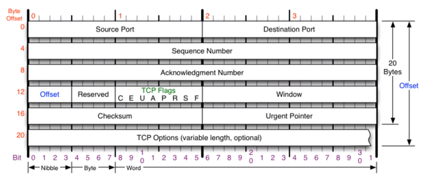
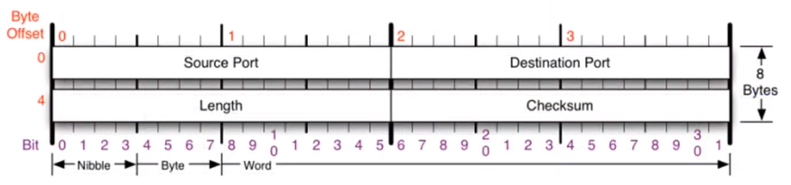

# 07. 컴퓨터의 프로그램끼리는 이렇게 데이터를 주고 받는다.

## 1. 4계층 프로토콜

1. 4계층에서 하는 일

   - 전송 계층(Transport layer)은 **송신자와 수신자의 프로세스를 연결하는 통신 서비스**를 제공한다.
   - 연결 지향 데이터 스트림 지원, 신뢰성, 흐름 제어, 다중화와 같은 서비스를 제공한다.

2. 4계층 프로토콜의 종류

   - TCP (Transmission Control Protocol) : 

     

   - UDP (User Datagram Protocol) : 비연결 지향

     

 

## 2. 포트 번호

1. 포트번호의 특징

   - **하나의 포트는 하나의 프로세스만** 사용 가능, **하나의 프로세스가 여러 개의 포트** 사용 가능
   - 특정 프로세스와 특정 프로세스가 통신을 하기 위해 사용한다. 
   - 일반적으로 정해져 있지만 무조건 지켜야하는 건 아니다. 

2. Well-Known 포트 : 전 세계적으로 유명

   

3. Registered 포트 : 조금은 유명한

   - 오라클 DB 서버 : 1521 번
   - MySQL 서버 : 3306 번
   - MS 원격 데스크탑 : 3389 번

4. Dynamic 포트 : 일반 사용자들이 사용

   - 49152 ~ 65535 번

 

## 3. 프로그램 연결 정보

1. 어떤 프로세스와 어떤 프로세스가 연결되어 있는지 확인
   - cmd창에 `netstat -ano`를 입력한다. 

 

## 4. 실습

1. 현재 연결 상태 확인하기
   - 네이버에 접속한 후 cmd창에 `netstat -ano`를 입력한다. 
   - 외부주소 뒤에 :443 붙은 것(네이버) PID를 확인하여 작업관리자에서 해당 PID를 찾아보면 크롬이다.
   - 네이버와 내 크롬이 해당 포트로 연결된 것
