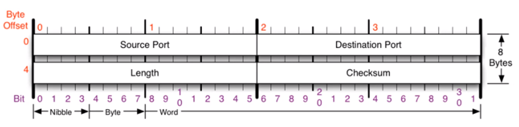

# 08. 비연결지향형 UDP 프로토콜

## 1. UDP 프로토콜

1. UDP가 하는 일

   - User Datagram Protocol
   - 단순한 전송 방식, **신뢰성이 낮다**. 데이터그램 도착 순서가 바뀌거나, 중복되거나 누락되기도 한다.

2. UDP 프로토콜의 구조

   - Length : UDP 프로토콜 길이 + 뒤의 payload 길이

   

 

## 2. UDP 프로토콜을 사용하는 프로그램

1. UDP 프로토콜을 사용하는 대표적인 프로그램들
   - DNS 서버 : 도메인을 물으면 IP를 알려줌
   - tftp 서버 : UDP로 파일을 공유
   - RIP 프로토콜 : 라우팅 정보를 공유

 

## 3. 실습 (X)

1. tftpd를 사용하여 데이터 공유해보기
   - Tftpd 프로그램을 이용하여 UDP를 이용한 데이터 통신 해보기
2. 패킷 캡쳐 및 분석해보기
   - UDP 패킷을 캡쳐해보고 분석하기

 
