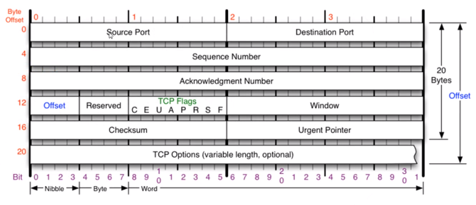
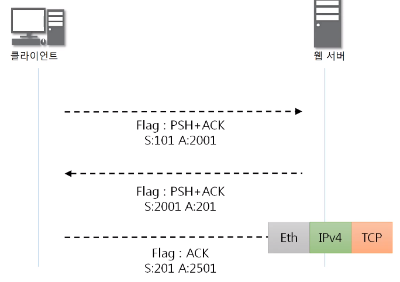
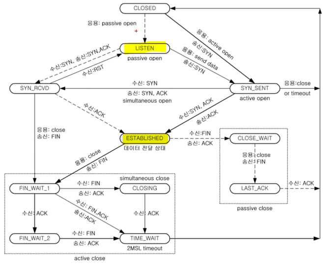

# 09. 연결지향형 TCP 프로토콜

## 1. TCP 프로토콜

1. TCP가 하는 일

   - 전송 제어 프로토콜 (Transmission Control Protocol)
   - 인터넷에 연결된 컴퓨터에서 실행되는 프로그램 간의 통신을 **안정적으로, 순서대로, 에러없이 교환**할 수 있게 한다.
   - TCP는 UDP보다 안전하지만 **느리다**.

2. TCP 프로토콜의 구조

   - Source / Destination Port : 출발 , 목적지 포트 번호
   - Sequence Number
   - Acknowledgment Number
   - Offset : header의 길이. 4로 나눠서 표현.
   - Reserved : 예약된 필드. 사용하지 않음.
   - TCP Flags : 아래에 설명. CE**UAPRSF**
   - Window : 연결이 됐을 때, 상대방에게 얼만큼 데이터를 보내면 내가 받을 수 있는지, 나의 남아있는 TCP 버퍼 공간
   - Checksum : checksum
   - Urgent Pointer : Flag에서 U가 1일 때, 어디서부터 긴급 데이터인지 알려준다.
   - TCP Option : IP 프로토콜의 Option이랑 비슷하다. 최대 10개 붙을 수 있고 4byte씩 가능. 기본 TCP 프로토콜 길이가 20 byte라서 최대 60 byte까지 가능

   

 

## 2. TCP 플래그

1. TCP 플래그의 종류, 기능
   - C : Congestion Window Reduced. 생략
   - E : ECN-Echo. 생략
   - U : Urgent. 긴급. 지금 보내는 데이터의 우선순위가 높다. Urgent Pointer와 같이 씀
   - **A** : Acknowledgment. 승인. 자주 쓰인다. 물어본 것에 대한 응답. 데이터 보내도 되는지, 연결해도 되는지 
   - P : Push. 밀어넣기. TCP 버퍼가 일정 크기 만큼 확보돼야 하는데 상관없이 밀어 넣겠다.
   - **R** : Reset. 초기화. 데이터 주고 받을 때, 문제가 발생하면 연결을 초기화
   - **S** : Sync. 동기화. 상대방과 연결을 시작할 때 사용. 이 이후로 연결이 동기화.
   - **F** : Fin. 종료

 

## 3. TCP를 이용한 통신과정

1. 연결 수립 과정

   - 프로세스와 프로세스를 연결하기 위해 가장 먼저 수행되는 과정 : 3Way handshake
     - 클라이언트가 서버에게 요청 패킷을 보낸다.
     - 서버가 클라이언트에게 요청을 받아들이는 패킷을 보낸다.
     - 클라이언트는 최종적으로 수락하는 패킷을 보낸다.

2. 3Way handshake

   - 3Way handshake 과정
     - seq 랜덤, ack는 0으로 설정해서 클라이언트가 서버에게 패킷을 보낸다.
     - 서버가 클라이언트에게 답장 보낼 때, ack는 seq + 1로, seq는 랜덤으로 보낸다.
     - 다시 클라이언트가 서버에게 보낼 때, ack는 seq + 1로, seq는 받았던 ack로 보낸다.
   -  세션 하이재킹 (Session Hijacking)
     - 3Way handshake, 동기화 과정으로 연결을 수립한 후 다음 요청은 클라이언트다.
     - 그런데, 외부(해커)에서 해당 동기화 값들을 계산해서 요청을 보내면 해당 해커와 통신을 하게 된다. 

   

3. 데이터 송수신 과정

   - seq, ack 번호 계산하기

     - 보낸 쪽에서 또 보낼 때는 seq, ack 번호가 그대로
     - 받은 쪽에서 seq 번호는 받은 ack번호가 된다.
     - 받은 쪽에서 **ack 번호는 받은 seq 번호 + 데이터 크기**
     - 3Way handshack 연결 수립할 때 seq + 1한 건, 뒤에 데이터가 없었어서.

   - 데이터 송수신 (위의 3Way handshack 연결 수립 이후)

     - 클라가 data 100 보낸다 (그림에는 생략). 보낸 쪽에서 또 보내는 것이기 때문에 syn 101, ack 2001
     - 서버는 data 100 받았고, 응답으로 data 500 을 보낸다. syn는 2001, ack는 101 + 100 = 201
     - 마지막으로 클라가 data 500을 받았기 때문에 응답으로 syn는 201, ack는 2001 + 500 = 2501

     

 

## 4. TCP 상태전이도

1. TCP 연결 상태의 변화

   - 실선 : 클라이언트, 점선 : 서버
   - LISTEN : 포트 번호를 열어 둔 상태. 프로그램이 사용하고 있는 상태. 클라이언트가 요청하면 연결을 수립할 수 있는 상태 
   - ESTABLISHED : 클라이언트와 연결이 수립된 상태

   

 
