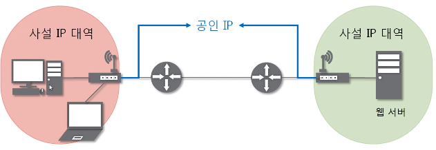
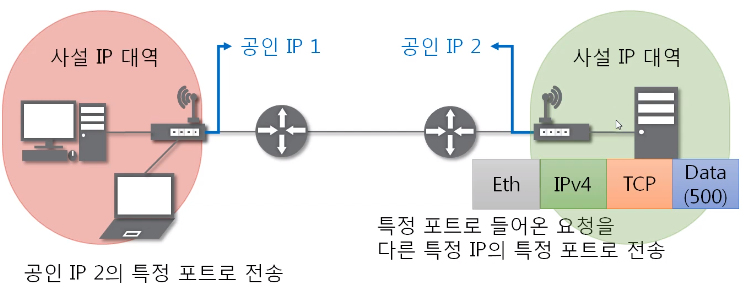

# 10. NAT와 포트 포워딩

## 1. NAT

1. NAT란 ?

   - Networdk Address Translation
   - IP 패킷의 **TCP/UDP 포트 숫자**와 **소스 및 목적지의 IP 주소** 등을 **재기록**하면서 라우터를 통해 네트워크 트래픽을 주고 받는 기술을 말한다.
   - 패킷에 변화가 생기기 때문에 IP나 TCP/UDP의 체크섬도 다시 계산되어 재기록된다.
   - NAT를 이용하는 이유는 **대개 사설 네트워크에 속한 여러개의 호스트가 하나의 공인 IP 주소를 사용하여 인터넷에 접속하기 위함**이다.
   - 하지만 꼭 사설IP를 공인 IP로 변환하는 데에만 사용하는 기술은 아니다. 

   

 

## 2. 포트포워딩

1. 포트 포워딩 (포트 매팅) 이란?

   - 패킷이 라우터나 방화벽과 같은 네트워크 장비를 가로지르는 동안 **특정 IP 주소와 포트 번호의 통신 요청을 특정 다른 IP와 포트 번호로 넘겨주는** 네트워크 주소 변환의 응용이다.
   - 게이트웨이(외부망)의 반대쪽에 위치한 사설네트워크에 상주하는 호스트에 대한 서비스를 생성하기 위해 흔히 사용된다.

2. 포트 포워딩 과정

   - 공인 IP 2의 공유기에 특정 포트(ex. 1234)에 포트 포워딩 설정함
   - 공인 IP 1 쪽에서 패킷을 만들어서 공인 IP 2의 특정 포트(ex. 1234)로 전송
   - 특정 포트(ex. 1234)로 들어온 요청을 다른 특정 IP의 특정 포트(ex. 4321)로 전송

   

 
