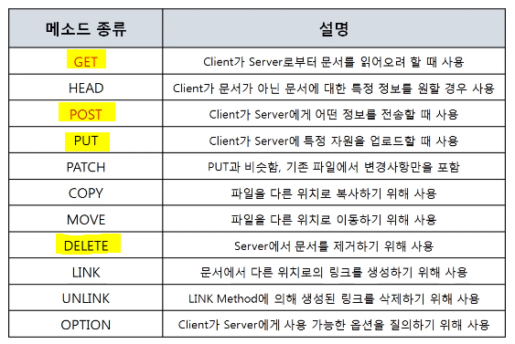
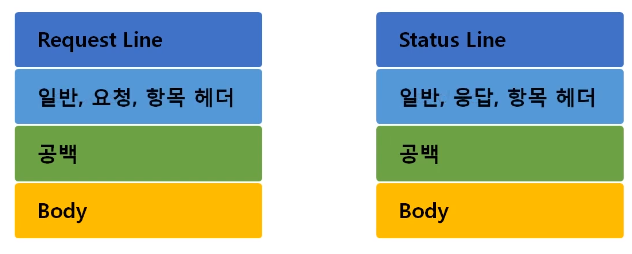

# 7계층 프로토콜 HTTP

## 1. HTTP 프로토콜

1. 웹을 만드는 기술들
   - 필수
     - HTTP (HTTPS => SSL/TLS) / HTML / JS / CSS
     - ASP / JSP / PHP
     - DB
   - 선택
     - Python / Spring / Jquery / Ajax
2. HTTP 프로토콜의 특징
   - HyperText Transfer Protocol
   - www에서 쓰이는 핵심 프로토콜로 **문서의 전송**을 위해 쓰이며, 오늘날 거의 모든 웹 애플리케이션에서 사용되고 있다. => 음성, 화상 등 여러 종류의 데이터를 MIME로 정의하여 전송 가능
   - **요청/응답**에 기반하여 서비스 제공
3. HTTP 프로토콜의 통신 과정
   - HTTP 1.0
     - 연결 수립, 동작, 해제의 단순함이 특징. 
     - HTML 문서를 전송 받은 뒤 연결을 끊고 다시 연결하여 데이터를 전송한다.
     - 문제 : 단순 동작(연결 수립-동작-해제 3단계)이 항상 반복되어 통신 부하 문제 발생
   - HTTP 1.1
     - 연결 수립 한 번 했으면 요청, 응답을 하고 마지막에 연결 종료

 

## 2. HTTP 요청 프로토콜

1. 요청 프로토콜의 구조

   - Request Line 구조 : `요청 타입` - `공백` - `URI` - `공백` - `HTTP 버전`
   - 공백 한 줄 들어가고 body 들어감

   

2. 요청 타입

   

3. URL

   - URI (Uniform Resource Identifier) 의 구조 
     - scheme `://host[:port][/path][?query]`
     - port의 경우, 80 이나 443은 웹 브라우저가 알아서 연결해준다.

 

## 3. HTTP 응답 프로토콜

1. 응답 프로토콜의 구조

   - Status Line 구조 : `HTTP 버전` - `공백` - `상태 코드` - `공백` - `상태 문구`

   

2. 상태 코드

   - 1xx : 단순한 정보
   - 2xx : Client 요청 성공
     - 200 OK : Client 요청 성공
   - 3xx : Client 요청이 수행되지 않아 다른 URL로 재지정
   - 4xx : Client의 요청이 불완전하여 다른 정보가 필요 (클라이언트의 잘못)
     - 403 Forbidden : Client가 권한이 없는 페이지 요청
     - 404 Not Found : Client가 서버에 없는 페이지 요청
   - 5xx : Server의 오류를 만나거나 Client 요청 수행 불가 (서버의 잘못)
     - 500 Internal Server Error : Server의 일부가 멈췄거나 설정 오류 발생
     - 503 Service Unavailable : 최대 Session 수를 초과

 

## 4. HTTP 헤더 포맷

1. HTTP 헤더 구조

   

2. 일반 헤더 : 일반적인 정보 담고 있음

   - Content-Length : 메시지 바디 길이를 나타낼 때
   - Content-Type : 메시지 바디에 들어있는 컨텐츠 종류 (ex. HTML 문서는 text/html)

3. 요청 헤더 : 클라이언트 정보를 담고 있음

   - Cookie : 서버로부터 받은 쿠키를 다시 서버에게 보내주는 역할
   - Host : 요청된 URL에 나타난 호스트명을 상세하게 표시 (HTTP 1.1은 필수)
   - User-Agent : Client Program에 대한 식별 가능 정보를 제공

4. 응답 헤더

   - Server : 사용하고 있는 웹서버의 소프트웨어에 대한 정보를 포함
   - Set-Cookie : 쿠키를 생성하고 브라우저에 보낼 때 사용. 해당 쿠키 값을 브라우저가 서버에게 다시 보낼 때 사용한다.
